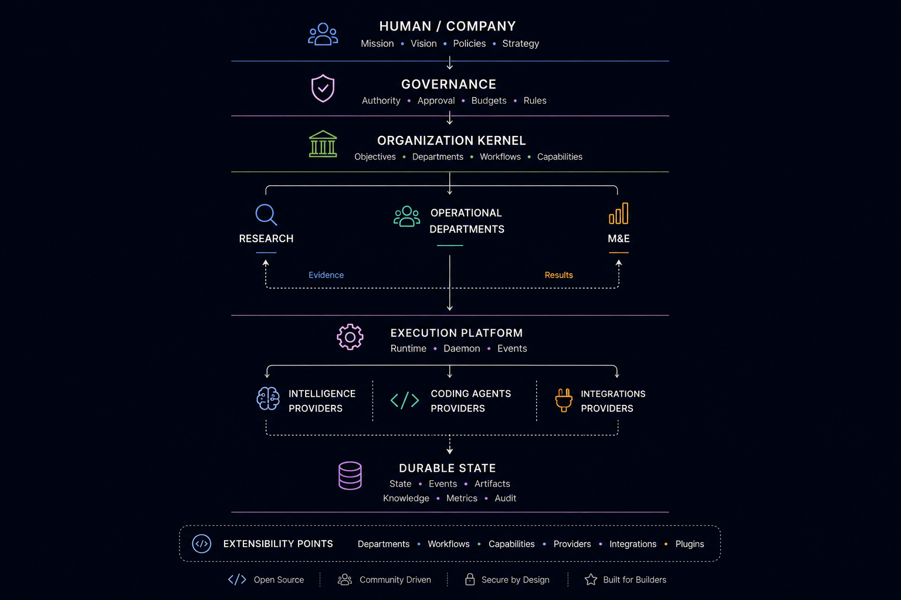

<div align="center">

# CompanyOS

### An open-source organizational runtime for building and operating semi-autonomous AI companies.

**Mission-driven · Governed · Extensible · Model-independent · Human-in-control**

<p>
  
  
  
</p>

</div>

---

<p align="center">
  
</p>

<p align="center">
  <sub>
    Mission and policy govern the organization. Research keeps it relevant.
    Departments execute. M&E measures outcomes. Finance keeps resource use efficient.
  </sub>
</p>

---

## What is CompanyOS?

CompanyOS explores a different abstraction for AI systems:

> **Instead of starting with agents, start with the organization.**

The organization defines its mission, vision, policies, objectives, departments, workflows, capabilities, authority boundaries, and measures of success.

AI agents, coding assistants, models, tools, and infrastructure then operate **inside those organizational boundaries**.

```text
Mission + Vision
       ↓
Policies + Strategy
       ↓
Objectives
       ↓
Departments
       ↓
Workflows
       ↓
Agents + Capabilities
       ↓
Actions + Artifacts
       ↓
Results
       ↓
Metrics + Evaluation
       ↓
Research + Strategic Adaptation
```

CompanyOS is therefore **not intended to be another multi-agent framework**.

Its primary abstraction is the **organization itself**.

---

## Why CompanyOS?

Most AI orchestration systems begin with:

```text
Agent → Tools → Task
```

CompanyOS begins higher in the hierarchy:

```text
Company
  ↓
Mission
  ↓
Governance
  ↓
Objectives
  ↓
Departments
  ↓
Workflows
  ↓
Agents / Teams
  ↓
Capabilities
  ↓
Results
  ↓
Evaluation
```

This allows autonomy to remain bounded by organizational intent rather than by prompts alone.

CompanyOS is being designed around four questions:

> **What should the company do?** — Research + Strategy  
> **What is it allowed to do?** — Governance  
> **How does work get executed?** — Runtime + Departments  
> **Did the work actually produce value?** — M&E + Finance

---

## Adaptive organization

Research, Monitoring & Evaluation, and Finance form the primary organizational feedback system.

```text
                    Research
                 "What changed?"
                       ↓
             Objectives / Decisions
                       ↓
             Operational Departments
                       ↓
                    Results
                  ↙         ↘
               M&E         Finance
         "Did it work?"  "Was it worth it?"
                  ↘         ↙
                    Evidence
                       ↓
                    Research
```

### 🔎 Research

Continuously investigates:

- customer problems
- market opportunities
- competitor movement
- technology changes
- security risks
- open-source ecosystems
- new AI models
- new coding agents
- cheaper or free intelligence resources

### 📊 Monitoring & Evaluation

Independently evaluates:

- correctness
- quality
- effectiveness
- reliability
- business outcomes
- model performance
- agent performance
- coding-agent performance
- cost-versus-quality

### 💰 Finance

Governs resource intelligence:

- organizational budgets
- model pricing
- coding-agent pricing
- infrastructure expenditure
- resource consumption
- cost anomalies
- effective cost per successful result

Research asks **what changed**.

M&E asks **whether our actions worked**.

Finance asks **whether the outcome justified the resources consumed**.

---

## Architecture

CompanyOS separates **organizational meaning** from **execution infrastructure**.

| Layer | Responsibility |
|---|---|
| 🧠 **Organization Kernel** | Organizational semantics, objectives, departments, workflows, capabilities, and invariants |
| 🛡️ **Governance** | Authority, policies, approvals, budgets, and autonomy boundaries |
| ⚙️ **Runtime** | Workflow execution, scheduling, retry, cancellation, checkpointing, waiting, and resume |
| ♾️ **Daemon** | Continuous availability, supervision, due-work activation, and runtime health |
| 🏢 **Departments** | Pluggable organizational functions operating through shared contracts |
| ✦ **Intelligence** | Provider-independent intelligence capabilities and evidence-driven model routing |
| `</>` **Coding Agent Runtime** | Vendor-independent delegation to mature software-engineering assistants |
| 📦 **Workspaces** | Isolated execution environments for engineering and external-effect work |
| 💾 **Durable State** | Authoritative state, events, artifacts, knowledge, metrics, and audit evidence |

The architectural boundaries are developed in:

**[ARCHITECTURE.md](ARCHITECTURE.md)**

Detailed architecture lives under:

**[`docs/architecture/`](docs/architecture/)**

> Architecture is currently being specified and audited.  
> DRAFT documents are not treated as accepted architectural decisions.

---

## Semi-autonomous by design

CompanyOS is designed around **bounded autonomy**.

Actions eventually fall into three authority classes:

| Authority | Meaning |
|---|---|
| 🟢 **Automatic** | CompanyOS may execute without human intervention |
| 🟡 **Approval required** | CompanyOS may prepare the action but must wait for authorization |
| 🔴 **Human only** | Authority remains exclusively with a human |

A human should be able to leave CompanyOS running, return later, and immediately answer:

> **What did the company discover?**  
> **What did it decide?**  
> **What did it do?**  
> **What needs my attention?**

Human absence should not stop authorized work.

Human intervention should not corrupt running work.

---

## Pluggable departments

Departments are intended to extend CompanyOS without redesigning the organizational kernel.

Current architectural direction includes:

| Department | Primary responsibility |
|---|---|
| 🔎 **Research** | Evidence, opportunities, risks, customers, competitors, technologies |
| 📊 **Monitoring & Evaluation** | Quality, outcomes, effectiveness, reliability, learning |
| ✏️ **Design** | Product design, UX, specifications, architecture proposals |
| `</>` **Engineering** | Software implementation, testing, review, maintenance |
| 🚀 **Deployment** | Releases, infrastructure, production operations |
| 📚 **Education & Engagement** | Education, awareness, community and user engagement |
| 💰 **Finance** | Budgets, costs, resource intelligence and efficiency |
| 🧩 **Future Departments** | Added through the same department extension contracts |

A future department should be installable through stable contracts rather than requiring Kernel changes.

---

## Model and coding-agent independent

CompanyOS should never depend organizationally on one AI provider.

Departments request **capabilities**, not brands.

```text
Task
 ↓
Capability + Complexity
 ↓
Governance + Finance constraints
 ↓
Research intelligence
 ↓
M&E performance evidence
 ↓
Router
 ↓
Best eligible provider
```

The same principle applies to coding assistants.

Engineering may eventually delegate repository-scale work to providers such as Codex, Claude Code, Gemini CLI, OpenHands, Aider, or future systems through a common `CodingAgentRuntime`.

```text
Engineering Task
      ↓
Coding Agent Router
      ↓
Isolated Workspace
      ↓
Implement
      ↓
Test
      ↓
Commit
      ↓
Pull Request
      ↓
Independent Review
      ↓
Governance Gate
      ↓
Merge
```

CompanyOS owns the engineering process.

The coding assistant remains replaceable.

---

## Open-source engineering provenance

CompanyOS deliberately studies mature open-source systems before implementing difficult infrastructure.

The objective is to **borrow engineering lessons, not blindly copy architectures**.

| Reference | What CompanyOS studies |
|---|---|
| [JARVIS](https://github.com/vierisid/jarvis) | Agent coordination, authority, approval, audit patterns |
| [LangGraph](https://github.com/langchain-ai/langgraph) | Graph execution, state and checkpoint concepts |
| [Temporal](https://github.com/temporalio/temporal) | Durable execution, recovery and failure semantics |
| [Cedar](https://github.com/cedar-policy/cedar) | Authorization and policy validation |
| **Inngest** | Event-driven scheduling and durable background execution |
| **Trigger.dev** | Long-running tasks, waits and retries |
| **OpenAI Agents SDK** | Agent, tool, handoff and guardrail patterns |
| **Open Multi-Agent** | Multi-agent coordination, task DAGs and budgets |

Every significant architectural feature should record:

```text
Reference studied
     ↓
Pattern discovered
     ↓
ADOPT / ADAPT / REJECT
     ↓
CompanyOS decision
     ↓
Vertical implementation
     ↓
Tests + evidence
```

See:

- [`docs/references/feature-provenance.md`](docs/references/feature-provenance.md)
- [`docs/references/references.lock.md`](docs/references/references.lock.md)

Reference implementations inform CompanyOS.

They do **not automatically become dependencies**.

---

## Vertical-slice development

CompanyOS is intentionally not being built subsystem-by-subsystem.

Development proceeds through small end-to-end slices.

```text
Problem
   ↓
Responsibility boundary
   ↓
Open-source reference study
   ↓
Architecture decision
   ↓
Threat + failure analysis
   ↓
Smallest useful implementation
   ↓
Tests
   ↓
Documentation
   ↓
Pull Request
   ↓
Evaluation
```

A meaningful feature should eventually produce three things:

### 1. Working software
Production-quality implementation and tests.

### 2. GitHub evidence
Issues, architecture decisions, commits, reviews and PRs.

### 3. Engineering knowledge
Documentation explaining the problem, trade-offs and implementation for future contributors.

---

## Repository map

```text
CompanyOS
│
├── AGENTS.md
│   Agent and coding-assistant engineering rules
│
├── ARCHITECTURE.md
│   Canonical architecture overview
│
├── ROADMAP.md
│   Vertical development roadmap
│
├── docs/
│   ├── INDEX.md
│   │   Task → context navigation
│   │
│   ├── architecture/
│   │   Architectural responsibilities and boundaries
│   │
│   ├── domain/
│   │   Domain concepts, lifecycle semantics and invariants
│   │
│   ├── adr/
│   │   Architecture Decision Records
│   │
│   ├── features/
│   │   Significant feature design and evidence
│   │
│   └── references/
│       Open-source research and provenance
│
└── .companyos/
    └── agent-memory/
        Compact, non-canonical context for coding agents
```

### Recommended reading order

```text
README
   ↓
AGENTS.md
   ↓
docs/INDEX.md
   ↓
ARCHITECTURE.md
   ↓
relevant domain / architecture docs
   ↓
accepted ADRs
   ↓
feature specification
```

This keeps both humans and coding agents from loading unnecessary context.

---

## Roadmap

CompanyOS is currently in its **architecture and documentation-control phase**.

### Phase 0 — Foundation

- [x] Define project direction
- [x] Establish documentation hierarchy
- [x] Establish open-source provenance process
- [ ] Complete architecture reconciliation
- [ ] Resolve remaining ownership boundaries
- [ ] Accept foundational ADRs

### Phase 1 — First vertical slice

```text
Organization
   ↓
Mission / Vision
   ↓
Objective
   ↓
Department
   ↓
Workflow
   ↓
Execution
   ↓
Persisted result
   ↓
Event
```

### Phase 2 — Governed execution

```text
Action
 ↓
Policy decision
 ↓
ALLOW / DENY / REQUIRE_APPROVAL
 ↓
Execution / Wait
 ↓
Resume
```

### Phase 3 — Adaptive organization

```text
Research
 ↓
Execution
 ↓
M&E
 ↓
Finance
 ↓
Research
```

See the full **[ROADMAP.md](ROADMAP.md)**.

---

## Contributing

CompanyOS is being designed as an open-source engineering project, not a closed internal prototype.

Useful contribution areas will include:

<p>
  
  
  
  
  
  
</p>

Before proposing a change:

1. Read **[AGENTS.md](AGENTS.md)**.
2. Locate the responsible module through **[`docs/INDEX.md`](docs/INDEX.md)**.
3. Read applicable domain invariants and accepted ADRs.
4. Study relevant pinned open-source references when appropriate.
5. Propose the **smallest vertical change**.
6. Include failure, security, test, and architectural considerations.
7. Avoid introducing infrastructure without a demonstrated responsibility.

See **[CONTRIBUTING.md](CONTRIBUTING.md)** for the evolving contributor workflow.

---

## Security

Semi-autonomous systems require strict authority boundaries.

CompanyOS is being designed around:

- least privilege
- explicit capabilities
- policy-gated external effects
- human approval boundaries
- auditable actions
- isolated engineering workspaces
- provider independence
- durable state
- failure recovery
- provenance-preserving evidence

Security design and reporting guidance live in **[SECURITY.md](SECURITY.md)**.

---

## Project status

> [!WARNING]
> **CompanyOS is currently pre-alpha.**
>
> The repository is primarily defining architecture, domain semantics, governance boundaries, reference provenance, and the first executable vertical slice.
>
> Documentation marked **DRAFT** is not an accepted architectural contract unless an accepted ADR or canonical domain specification explicitly establishes it.

No production-ready autonomous-company runtime is claimed at this stage.

---

<div align="center">

## Build the organization layer for AI.

**Mission-driven. Evidence-driven. Governed. Extensible.**

<br />

<a href="./CONTRIBUTING.md">
  
</a>

<br /><br />

<sub>
Built openly for engineers interested in AI orchestration, distributed systems,
organizational runtimes, durable execution, governance, and autonomous software engineering.
</sub>

</div>
