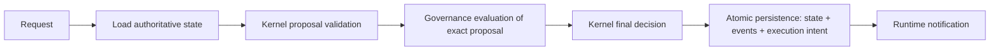

# CompanyOS Application Layer

Status: DRAFT

## Responsibility

The Application layer is the provider-independent orchestration boundary for CompanyOS use cases. It coordinates authenticated requests across Governance, the Kernel, Persistence, and Runtime without taking ownership of any of their rules or mechanisms.

For a state-changing use case, the Application layer owns this sequence:

The durable commit is the success boundary. Runtime notification is a recoverable wake-up hint for already-persisted intent; notification failure cannot erase the accepted transition or require the domain decision to be repeated.

## Owns

- one application use case per externally meaningful organizational operation;
- request normalization into provider-independent commands and stable identities;
- loading the required authoritative state and versions through persistence ports;
- invoking the Kernel's non-mutating proposal validation to obtain the exact command, Action, Resource, normalized-arguments digest, and state version that Governance must evaluate;
- constructing Governance requests from authenticated, trusted, and referenced context;
- invoking Governance and handling `ALLOW`, `DENY`, and `REQUIRE_APPROVAL` without reinterpretation;
- invoking the Kernel with the command, authoritative snapshot, declared time, and required governance evidence;
- coordinating atomic persistence of accepted state, domain events, and caused execution intent;
- notifying Runtime after commit and exposing committed intent for recovery when notification fails;
- returning normalized accepted, rejected, approval-required, conflict, or indeterminate outcomes;
- correlation, causation, idempotency, and audit context across the orchestration sequence.

## Does not own

The Application layer does not own:

- organizational meaning, domain invariants, legal transitions, or event meaning;
- authorization policy, authority, autonomy classification, or approval semantics;
- queues, scheduling, retries, timers, workers, leases, checkpoints, or dispatch;
- database technology, schemas, queries, transactions, migrations, brokers, or outbox implementation;
- provider routing algorithms, model or coding-agent behavior, workspaces, or external effects;
- process lifetime, health supervision, deployment topology, or infrastructure selection.

It may sequence calls to owners of those responsibilities. Sequencing does not transfer ownership.

## Application request

An `ApplicationRequest` contains request and idempotency identities; organization; authenticated Principal reference; requested use case and domain command data; target resource; objective, workflow, and department context when applicable; expected authoritative-state version; declared request time; correlation and causation identities; input artifact/evidence references; and security classification.

Transport headers, UI models, provider payloads, and agent messages are translated and validated at adapters before becoming an ApplicationRequest. They remain untrusted input and cannot supply authority merely by containing an identity or approval claim.

## First vertical slice

The first state-changing slice is `StartWorkflow`: transition one existing `PLANNED` [Workflow](../domain/workflow.md) for an existing approved Objective to `READY` and create exactly one ExecutionIntent for its first Capability step. The Workflow is the aggregate root. Objective, WorkflowDefinition, CapabilityDefinition, Principal, policy, approval, and resource records are referenced by immutable identity/version and are not members of the aggregate.

The request must name the Organization, Workflow, expected Workflow version, Objective/version, WorkflowDefinition/version, command identity, idempotency identity, requesting Principal and authenticated-evidence reference, declared time, correlation/causation identities, bounded input Artifact/Evidence references, and applicable ResourceConstraint versions. Missing or stale references reject the operation rather than being inferred.

## Shared command and decision envelopes

The [Command domain contract](../domain/command.md) owns `WorkflowCommandEnvelope`, `GovernedCommandProposal`, `KernelDecisionEnvelope`, and `PendingCommand`. Application validates and coordinates these envelopes but does not define their meaning. The first slice uses `START_WORKFLOW` and the Action `workflow.start` without making those slice-specific values Application contracts.

## State-changing use case

1. Validate envelope shape, organization scope, identity references, command type, idempotency identity, and input classifications.
2. Load the minimum authoritative state and exact versions required by the use case.
3. Ask the Kernel to perform **proposal validation**. This pure stage validates domain shape and state-independent or currently knowable invariants and returns either stable rejection reasons or an immutable `GovernedCommandProposal` containing the exact command, Action, Resource, normalized-arguments digest, authoritative-state version, and proposed effect classification. It returns no next state, domain events, or executable intent.
4. Submit that exact proposal plus authenticated context to Governance. Governance evaluates the proposal without changing it.
5. On `DENY`, return denial without a domain transition or execution intent.
6. On `REQUIRE_APPROVAL`, atomically persist the Governance decision, immutable `PendingCommand`, and `PENDING` Approval linked by organization, request identity, proposal digest, state version, policy/authority versions, and expiry. Do not apply the proposed aggregate transition or create executable intent.
7. When approval resolves, process it as a new idempotent Application request: reload the pending command and current authoritative state, verify the proposal digest and versions, and ask Governance to evaluate the exact proposal again with the Approval evidence. Changed command content creates a new proposal; stale state, policy, authority, identity, or approval evidence cannot be silently reused.
8. Only on current `ALLOW`, invoke the Kernel's **final decision** stage with the unchanged proposal, current authoritative snapshot, declared time, and persisted Governance evidence. The Kernel revalidates all domain invariants; Governance permission does not make an illegal command legal.
9. If final Kernel validation rejects, return stable domain reasons without applying the proposed transition or creating execution intent.
10. If the Kernel accepts, atomically compare-and-write the next authoritative state, its domain events, the Governance-decision reference, consumption of any single-use Approval, closure of the PendingCommand, and any caused execution intent.
11. Only after commit, notify Runtime that persisted intent may be claimed. If notification fails, return the committed outcome with notification status and rely on durable recovery scanning or outbox delivery.
12. Return persisted identities and versions, never an uncommitted proposed state.

## Two-stage Kernel contract

`GovernedCommandProposal` is a bounded handoff contract, not authoritative state, authorization, or a promise that the command will remain legal. Proposal validation exists only to give Governance an exact, canonical subject to evaluate when Action, Resource, or normalized arguments depend on domain interpretation.

The final Kernel decision is the sole stage that may propose authoritative next state, domain events, and effects. It must consume the same proposal digest Governance evaluated and revalidate the current authoritative version. A mismatch, stale version, or material context change invalidates the prior proposal and requires a new proposal and Governance evaluation.

Use cases whose Action, Resource, and normalized arguments are already canonical still pass through proposal validation; the stage may be trivial, but it is never bypassed. This establishes one ordering for all state-changing commands rather than allowing each use case to choose whether Governance or Kernel runs first.

## Pending approval atomicity

A `PendingCommand` preserves the immutable proposal and its governance context while no target-domain transition has been authorized. The atomic pending-approval write contains the pending command, `REQUIRE_APPROVAL` decision, `PENDING` Approval, and audit event. It contains no executable intent and does not mark the requested business action accepted, scheduled, or performed.

Approval resolution changes only the Approval lifecycle until the resumed Application request obtains a current `ALLOW` and a final Kernel decision. The accepted transaction then atomically consumes applicable single-use approval evidence, closes the PendingCommand, and persists the authorized domain transition, events, and execution intent. Duplicate resolution or resume attempts are constrained by request identity, proposal digest, and optimistic versions.

Read-only use cases still enforce organization, identity, authorization, classification, and projection-freshness requirements but do not invent a write transaction.

## Runtime-result use case

Runtime and provider outputs re-enter CompanyOS as new ApplicationRequests containing attributable execution evidence. The Application layer reloads current authoritative state, obtains any required Governance decision, asks the Kernel whether the result permits a legal transition, and persists the resulting state/events/next intent before Runtime advances.

Runtime never calls a storage adapter to mark organizational work complete. A provider callback, checkpoint, success message, artifact, or exit code cannot bypass this use case.

## Dispatch-time governance

Initial `ALLOW` permits persistence of a bounded execution intent only when policy allows that step. Immediately before a governed external effect, Runtime requests a dispatch use case from the Application layer. That use case reloads relevant current authority, policy, approval, resource, and intent versions; asks Governance to re-evaluate the exact action; and records the decision before Runtime dispatches.

`REQUIRE_APPROVAL`, `DENY`, stale input, or changed action arguments block dispatch. The Application layer coordinates this check but Governance owns the result.

## Transaction and notification semantics

- For `StartWorkflow`, the accepted atomic write contains the Workflow transition `PLANNED → READY`, resulting DomainEvents, GovernanceDecision reference, closure of any PendingCommand, consumption of any applicable single-use Approval, idempotency outcome, and exactly one caused ExecutionIntent.
- Optimistic-concurrency failure rejects the attempted commit; the use case reloads and re-evaluates rather than merging implicitly.
- A timeout or lost response is `INDETERMINATE` until reconciled by request/idempotency identity.
- Retrying the same logical request reuses its idempotency identity and cannot create a second legal transition.
- Runtime notification is never included in the database transaction and never precedes it.
- Durable intent discovery, an outbox publisher, or both recover missed notifications; the concrete mechanism remains a Persistence/Runtime adapter decision.
- Application logs and in-memory outcomes do not replace persisted state, events, decisions, or intents.

## Failure outcomes

Application use cases return a normalized outcome:

- `ACCEPTED`: the authoritative transaction committed;
- `REJECTED`: request or Kernel legality failed without a commit;
- `DENIED`: Governance returned `DENY`;
- `APPROVAL_REQUIRED`: Governance returned `REQUIRE_APPROVAL` and any required pending record committed;
- `CONFLICT`: an authoritative version changed before commit;
- `UNAVAILABLE`: a required dependency failed before any indeterminate write;
- `INDETERMINATE`: commit or external reconciliation outcome is unknown;
- `INVALID`: the request envelope or referenced inputs were invalid.

These application outcomes do not replace domain, Governance, Runtime, or provider failure taxonomies; they preserve their typed reasons and references.

## Invariants

- Every organizational state mutation passes through an explicit Application use case and a Kernel decision.
- Every governed action passes through Governance; the Application layer cannot convert `DENY` or `REQUIRE_APPROVAL` into `ALLOW`.
- Governance permission and Kernel legality are both necessary and neither substitutes for the other.
- Governance evaluates the immutable proposal produced by preliminary Kernel validation; the final Kernel decision revalidates the same digest against current authoritative state.
- Proposal validation cannot mutate state, emit authoritative events, create executable intent, or grant authority.
- `REQUIRE_APPROVAL` persists a pending command and approval atomically without applying the proposed domain transition or producing executable intent.
- Accepted state, resulting domain events, and caused execution intent commit atomically.
- Runtime is notified only after commit and can recover persisted intent without the original process.
- Application orchestration never contains domain rules, policy rules, scheduling logic, or storage-specific behavior.
- Requests, results, decisions, events, and intents preserve organization, correlation, causation, principal, and idempotency identities.
- Failures before commit cause no dependent execution; indeterminate commits are reconciled before retry.
- Agent, provider, transport, and conversation state cannot directly invoke persistence or Runtime as authoritative work.

## OPEN QUESTIONS

- Which notification recovery mechanism is minimal for the first slice?

## Dependencies

- [Top-level architecture](../../ARCHITECTURE.md)
- [Kernel](kernel.md)
- [Governance](governance.md)
- [Persistence](persistence.md)
- [Event domain contract](../domain/event.md)
- [Workflow and execution-intent contracts](../domain/workflow.md)
- [Command domain contract](../domain/command.md)
