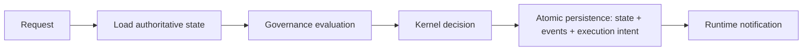

# CompanyOS Application Layer

Status: DRAFT

## Responsibility

The Application layer is the provider-independent orchestration boundary for CompanyOS use cases. It coordinates authenticated requests across Governance, the Kernel, Persistence, and Runtime without taking ownership of any of their rules or mechanisms.

For a state-changing use case, the Application layer owns this sequence:

The durable commit is the success boundary. Runtime notification is a recoverable wake-up hint for already-persisted intent; notification failure cannot erase the accepted transition or require the domain decision to be repeated.

## Owns

- one application use case per externally meaningful organizational operation;
- request normalization into provider-independent commands and stable identities;
- loading the required authoritative state and versions through persistence ports;
- constructing Governance requests from authenticated, trusted, and referenced context;
- invoking Governance and handling `ALLOW`, `DENY`, and `REQUIRE_APPROVAL` without reinterpretation;
- invoking the Kernel with the command, authoritative snapshot, declared time, and required governance evidence;
- coordinating atomic persistence of accepted state, domain events, and caused execution intent;
- notifying Runtime after commit and exposing committed intent for recovery when notification fails;
- returning normalized accepted, rejected, approval-required, conflict, or indeterminate outcomes;
- correlation, causation, idempotency, and audit context across the orchestration sequence.

## Does not own

The Application layer does not own:

- organizational meaning, domain invariants, legal transitions, or event meaning;
- authorization policy, authority, autonomy classification, or approval semantics;
- queues, scheduling, retries, timers, workers, leases, checkpoints, or dispatch;
- database technology, schemas, queries, transactions, migrations, brokers, or outbox implementation;
- provider routing algorithms, model or coding-agent behavior, workspaces, or external effects;
- process lifetime, health supervision, deployment topology, or infrastructure selection.

It may sequence calls to owners of those responsibilities. Sequencing does not transfer ownership.

## Application request

An `ApplicationRequest` contains request and idempotency identities; organization; authenticated Principal reference; requested use case and domain command data; target resource; objective, workflow, and department context when applicable; expected authoritative-state version; declared request time; correlation and causation identities; input artifact/evidence references; and security classification.

Transport headers, UI models, provider payloads, and agent messages are translated and validated at adapters before becoming an ApplicationRequest. They remain untrusted input and cannot supply authority merely by containing an identity or approval claim.

## State-changing use case

1. Validate envelope shape, organization scope, identity references, command type, idempotency identity, and input classifications.
2. Load the minimum authoritative state and exact versions required by the use case.
3. Build and submit the Governance request. Persist or reuse its attributable decision according to the Governance contract.
4. On `DENY`, return rejection without invoking the Kernel for an authorized transition. On `REQUIRE_APPROVAL`, persist the pending governed request and return without execution.
5. On `ALLOW`, invoke the Kernel. Governance permission does not make an illegal domain command legal.
6. If the Kernel rejects, return stable domain reasons without state mutation or execution intent.
7. If the Kernel accepts, atomically compare-and-write the next authoritative state, its domain events, the Governance-decision reference, and any caused execution intent.
8. Only after commit, notify Runtime that persisted intent may be claimed. If notification fails, return the committed outcome with notification status and rely on durable recovery scanning or outbox delivery.
9. Return persisted identities and versions, never an uncommitted proposed state.

Read-only use cases still enforce organization, identity, authorization, classification, and projection-freshness requirements but do not invent a write transaction.

## Runtime-result use case

Runtime and provider outputs re-enter CompanyOS as new ApplicationRequests containing attributable execution evidence. The Application layer reloads current authoritative state, obtains any required Governance decision, asks the Kernel whether the result permits a legal transition, and persists the resulting state/events/next intent before Runtime advances.

Runtime never calls a storage adapter to mark organizational work complete. A provider callback, checkpoint, success message, artifact, or exit code cannot bypass this use case.

## Dispatch-time governance

Initial `ALLOW` permits persistence of a bounded execution intent only when policy allows that step. Immediately before a governed external effect, Runtime requests a dispatch use case from the Application layer. That use case reloads relevant current authority, policy, approval, resource, and intent versions; asks Governance to re-evaluate the exact action; and records the decision before Runtime dispatches.

`REQUIRE_APPROVAL`, `DENY`, stale input, or changed action arguments block dispatch. The Application layer coordinates this check but Governance owns the result.

## Transaction and notification semantics

- The atomic write contains the authoritative version transition, domain events, and execution intent caused by that transition.
- Optimistic-concurrency failure rejects the attempted commit; the use case reloads and re-evaluates rather than merging implicitly.
- A timeout or lost response is `INDETERMINATE` until reconciled by request/idempotency identity.
- Retrying the same logical request reuses its idempotency identity and cannot create a second legal transition.
- Runtime notification is never included in the database transaction and never precedes it.
- Durable intent discovery, an outbox publisher, or both recover missed notifications; the concrete mechanism remains a Persistence/Runtime adapter decision.
- Application logs and in-memory outcomes do not replace persisted state, events, decisions, or intents.

## Failure outcomes

Application use cases return a normalized outcome:

- `ACCEPTED`: the authoritative transaction committed;
- `REJECTED`: request or Kernel legality failed without a commit;
- `DENIED`: Governance returned `DENY`;
- `APPROVAL_REQUIRED`: Governance returned `REQUIRE_APPROVAL` and any required pending record committed;
- `CONFLICT`: an authoritative version changed before commit;
- `UNAVAILABLE`: a required dependency failed before any indeterminate write;
- `INDETERMINATE`: commit or external reconciliation outcome is unknown;
- `INVALID`: the request envelope or referenced inputs were invalid.

These application outcomes do not replace domain, Governance, Runtime, or provider failure taxonomies; they preserve their typed reasons and references.

## Invariants

- Every organizational state mutation passes through an explicit Application use case and a Kernel decision.
- Every governed action passes through Governance; the Application layer cannot convert `DENY` or `REQUIRE_APPROVAL` into `ALLOW`.
- Governance permission and Kernel legality are both necessary and neither substitutes for the other.
- Accepted state, resulting domain events, and caused execution intent commit atomically.
- Runtime is notified only after commit and can recover persisted intent without the original process.
- Application orchestration never contains domain rules, policy rules, scheduling logic, or storage-specific behavior.
- Requests, results, decisions, events, and intents preserve organization, correlation, causation, principal, and idempotency identities.
- Failures before commit cause no dependent execution; indeterminate commits are reconciled before retry.
- Agent, provider, transport, and conversation state cannot directly invoke persistence or Runtime as authoritative work.

## OPEN QUESTIONS

- What is the exact shared command/decision/intent envelope for the first vertical slice?
- Which use cases require Governance before Kernel evaluation versus a preliminary Kernel validation that produces the exact governed action?
- What aggregate and transaction boundary will the first implementation use?
- How is a pending approval request atomically related to its proposed command without persisting an unauthorized domain transition?
- Which notification recovery mechanism is minimal for the first slice?

## Dependencies

- [Top-level architecture](../../ARCHITECTURE.md)
- [Kernel](kernel.md)
- [Governance](governance.md)
- [Persistence](persistence.md)
- [Events](events.md)
- Future shared workflow and execution-intent contracts
