# Coding-Agent Architecture

Status: DRAFT

## Responsibility

CompanyOS Engineering turns an approved design into reviewable repository evidence through provider-independent coding-agent contracts. Engineering depends on `CodingAgentRuntime`, `CodingAgentRouter`, `EngineeringWorkspace`, and `WorkspaceProvider`; Codex, Claude Code, Gemini CLI, OpenHands, and Aider are replaceable providers or adapters.

This architecture owns task normalization, provider eligibility and selection, bounded session execution, independent result validation, and engineering evidence. It does not own organizational approval, domain legality, durable workflow scheduling, provider internals, workspace infrastructure, repository hosting, or merge authority.

`CodingAgentRuntime` is a specialized execution port coordinated by the CompanyOS [Runtime](runtime.md). It is not a second authoritative workflow runtime.

## Required flow

```mermaid
flowchart LR
    Objective[Approved objective] --> Design[Design specification]
    Design --> Task[EngineeringTask]
    Task --> Router[CodingAgentRouter]
    Router --> Agent[CodingAgentRuntime adapter]
    Agent --> Workspace[Isolated EngineeringWorkspace]
    Workspace --> Branch[Feature branch]
    Branch --> Change[Implementation and iteration]
    Change --> Verify[Tests, lint, and build]
    Verify --> Commit[Governed commit]
    Commit --> Push[Governed push]
    Push --> PR[Governed PR preparation]
    PR --> Independent[Independent review]
    Independent --> Lead[Lead review]
    Lead --> Gate[Governance gate]
    Gate --> Merge[Merge]
```

Every transition that changes authoritative workflow state is performed by an application use case after persistence succeeds. Agent messages, plans, command output, and self-reported success are evidence only.

## Core contracts

### EngineeringTask

An immutable, versioned request for one bounded engineering outcome. It records task, organization, objective, design, repository, base-revision, acceptance-criteria, file-scope, allowed-tool, required-validation, risk, deadline, budget, data-classification, and governance references. It also specifies prohibited operations and the required result evidence. It names required capabilities, never a provider.

Material scope changes produce a new task version and a new routing decision. An agent may propose a scope change but cannot authorize one.

### EngineeringResult

A normalized result for one task attempt. It contains status, task/profile/adapter/session/workspace identities, base and final revisions, patch or diff, changed paths, commands and exit results, test/lint/build evidence, commits, artifacts, unresolved findings, failure classification, usage/cost, timestamps, and provenance.

The result is not proof of correctness. CompanyOS independently verifies workspace state, diff scope, Git ancestry, command results, and required checks before accepting it or advancing the workflow.

### CodingAgentProfile

A versioned description of a provider runtime: adapter and provider identifiers, supported languages and task classes, tool and context limits, execution modes, workspace and sandbox requirements, data-handling properties, cost and latency, known failure modes, and current lifecycle status. Claims require dated evidence.

### CodingAgentEvaluation

M&E-owned evidence relating a profile to a task class and environment. It records evaluation suite and repository fixture versions, quality and completion measures, regression and unsafe-action rates, test validity, latency, cost, recovery behavior, sample size, confidence, provenance, and validity window. Agent self-report is not evaluation evidence.

### CodingAgentRuntime

A provider-independent port that starts, observes, pauses, resumes, cancels, and terminates one bounded coding session in an assigned workspace. It normalizes plans, tool requests, file changes, command results, usage, checkpoints, and failures. An adapter may translate these operations to a local CLI, remote service, or agent server.

It does not select itself, provision workspaces, inject unrestricted credentials, approve tools, declare tests valid, commit or publish without authorization, mutate authoritative task state, or decide acceptance.

### CodingAgentRouter

An eligibility-first selector. It filters profiles using required task capabilities, language/repository fit, tool support, context needs, sandbox compatibility, privacy, policy, budget, availability, and evidence freshness. It then ranks eligible profiles using quality, historical reliability, recovery behavior, latency, and effective cost.

The persisted routing decision records candidates, exclusions, evidence versions, selected profile, fallback sequence, estimates, tie-breaking, and router version. A provider override is a governed, expiring constraint with a reason, not a field on `EngineeringTask`.

## Execution lifecycle

1. Validate that objective and design approvals, repository identity, immutable base revision, scope, and acceptance criteria exist.
2. Persist the `EngineeringTask`, governance evidence, and idempotency identity.
3. Route only among eligible, evidence-backed profiles; persist the routing decision before dispatch.
4. Ask `WorkspaceManager` for an isolated `EngineeringWorkspace` rooted at the exact base revision and a task-specific feature branch.
5. Start a bounded session with least-privilege tools, credentials, network policy, time and cost limits, and a context manifest.
6. Allow iterative inspection, planning, editing, shell execution, debugging, and validation. Each effect is attributed and captured as evidence.
7. Independently verify changed paths, diff, repository status, required checks, secret scanning, and prohibited-operation policy.
8. Create a commit, push, and prepare a pull request only through separate governed actions. Record remote identities and immutable revisions.
9. Require an independent review and lead review before the final governance decision. Reviewer independence criteria are an **OPEN QUESTION**.
10. Merge only after the governance gate permits it. Preserve result and audit evidence before cleanup.

Retries create distinct attempts. Automatic retry is allowed only for classified transient failures and must reuse the task idempotency identity while receiving a fresh workspace or a verified checkpoint. A failed or timed-out session cannot silently continue.

## Context management

- Begin from the task, design, repository instructions, applicable accepted ADRs, and a bounded repository map.
- Discover additional files through explicit dependency or search evidence; do not ingest the repository by default.
- Record the context-manifest paths and revisions used for the attempt.
- Condensation or provider memory may aid a session but never replaces task, Git, validation, or workflow records.
- Resumption verifies task version, base revision, workspace lease, adapter version, and checkpoint integrity before execution.
- Secrets and irrelevant personal or organizational memory are excluded from prompts and logs.

## Failure model

Normalized failures include invalid task, no eligible provider, provisioning failure, context exhaustion, tool denial, command failure, invalid edit, validation failure, timeout, cancellation, provider loss, workspace corruption, policy violation, budget exhaustion, publication failure, and indeterminate outcome.

An indeterminate external effect, including an uncertain push or PR creation, is reconciled using remote idempotency evidence before retry. Provider fallback never bypasses the original privacy, policy, budget, workspace, or validation constraints.

## Evidence from mature implementations

| Reference and inspected source | Proven pattern | Adopt or adapt | Reject as CompanyOS authority |
|---|---|---|---|
| [OpenHands agent-server adapter](https://github.com/OpenHands/OpenHands/blob/551e9a9ee6cc26feaa9ff2bf33a34f0442368c84/src/api/agent-server-adapter.ts), [runtime service](https://github.com/OpenHands/OpenHands/blob/551e9a9ee6cc26feaa9ff2bf33a34f0442368c84/src/api/runtime-service/agent-server-runtime-service.ts), and tests | Agent-server compatibility boundary, session-key-authenticated remote command execution, explicit local/cloud runtime modes | Normalize provider sessions and runtime operations behind an adapter; test adapter behavior | Provider conversation or sandbox state as organizational workflow state |
| [Aider `base_coder.py`](https://github.com/Aider-AI/aider/blob/5dc9490bb35f9729ef2c95d00a19ccd30c26339c/aider/coders/base_coder.py), [`repo.py`](https://github.com/Aider-AI/aider/blob/5dc9490bb35f9729ef2c95d00a19ccd30c26339c/aider/repo.py), and [`repomap.py`](https://github.com/Aider-AI/aider/blob/5dc9490bb35f9729ef2c95d00a19ccd30c26339c/aider/repomap.py) | Repository maps bound context; edits integrate with diff, lint/test, and Git commit handling | Use repository maps, explicit validation evidence, and Git-aware result capture | Direct auto-commit, dirty-tree mutation, or provider-selected validation as sufficient approval |
| [OpenAI Agents SDK tools](https://github.com/openai/openai-agents-js/blob/2d68a10f8c1593f37a8e291e7bce00634ba3e5dd/packages/agents-core/src/tool.ts), [run state](https://github.com/openai/openai-agents-js/blob/2d68a10f8c1593f37a8e291e7bce00634ba3e5dd/packages/agents-core/src/runState.ts), and [session contract](https://github.com/openai/openai-agents-js/blob/2d68a10f8c1593f37a8e291e7bce00634ba3e5dd/packages/agents-core/src/memory/session.ts) | Shell and patch tools have explicit approval hooks; run state is serializable; sessions expose history operations | Normalize tool requests, approval interrupts, serialization, and resumable adapter state | Generic agent run/session history as authoritative engineering state |
| [JARVIS terminal executor](https://github.com/Node-Features/JARVIS/blob/6e144520c747a6e0b8673ba9b75769d5d5f10a9c/src/actions/terminal/executor.ts) and [Git manager](https://github.com/Node-Features/JARVIS/blob/6e144520c747a6e0b8673ba9b75769d5d5f10a9c/src/sites/git-manager.ts) | Typed command results, timeouts, streaming, and encapsulated branch/commit operations | Reuse the small adapter pattern and explicit command results | Raw shell wrappers or automatic commits as sandbox, policy, or review boundaries |

## Invariants

- Engineering code imports CompanyOS contracts, never concrete coding-agent SDKs or CLIs.
- A provider receives one bounded task and one assigned workspace; it has no organizational authority.
- The exact base revision, task version, profile version, adapter version, and routing decision are recorded before execution.
- File, shell, Git, network, credential, and publication operations are limited independently.
- Agent plans, messages, memory, command output, and success claims are non-authoritative evidence.
- Required checks are independently observed; a provider cannot waive or redefine them.
- Commit, push, PR creation, review acceptance, and merge are distinct governed actions.
- The implementation agent cannot satisfy the independent-review requirement for its own result.
- Persistence succeeds before dispatch, retry, publication, or workflow advancement.
- Cancellation or lease expiry revokes execution and credentials; late results cannot advance state.

## OPEN QUESTIONS

- Which task taxonomy and benchmark suite establish profile eligibility?
- What independence boundary is required between implementation, independent review, and lead review?
- Which Git actions may be automatic at each autonomy level?
- Which provider session checkpoints are portable enough to resume safely?
- What evidence-retention and redaction periods apply to prompts, patches, and command output?
