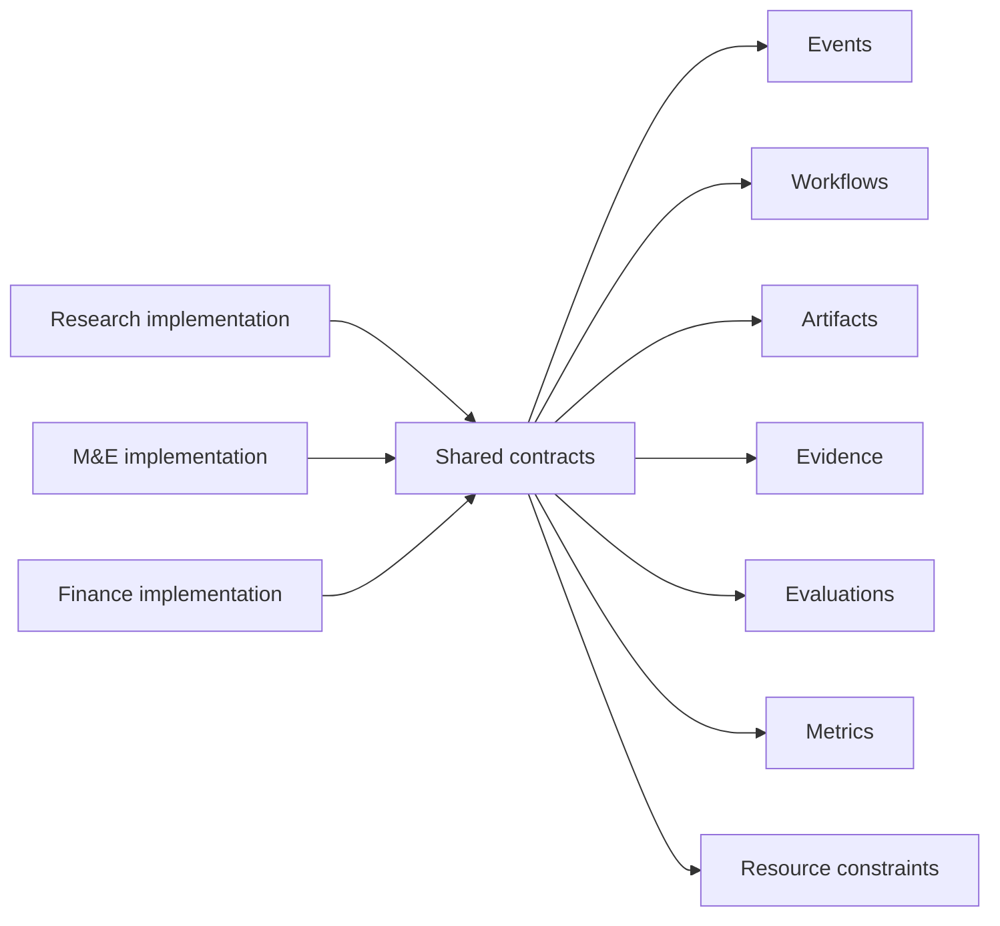
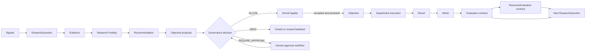

# CompanyOS Department Architecture

Status: DRAFT

## Responsibility

Departments are pluggable organizational modules. They group a mission, roles, workflows, policies, capabilities, metrics, event contracts, and knowledge scope behind one validated `DepartmentDefinition`. Adding, replacing, disabling, or removing a department must not require Kernel redesign.

The Kernel owns department identity, lifecycle semantics, invariants, and shared registration contracts. A department owns only its declared organizational responsibility. Runtime executes its workflows; Governance evaluates its actions; shared capability, event, workflow, metric, and knowledge abstractions mediate collaboration.

## Dependency rule

Department implementations may depend on:

- shared Kernel and domain abstractions;
- stable application ports;
- their own internal implementation;
- provider adapters injected behind declared capabilities.

They must not import another department's implementation, storage schema, internal commands, agents, or provider adapters.

Therefore:

- Research must not import Engineering.
- Engineering must not import Finance.
- No future department may gain privileged coupling merely because it ships in the core distribution.

Departments coordinate only through:

- versioned events for facts already accepted into authoritative state;
- workflow contracts for governed multi-step collaboration;
- capability requests for provider-independent outcomes;
- artifact and evidence references with provenance and access policy;
- canonical Evaluation, Metric, and ResourceConstraint contracts;
- minimal shared Kernel abstractions for identities, commands, decisions, and invariants.



Arrows mean “depend on,” not “write every contract.” Reading another department's public artifact through a governed shared contract is permitted. Calling its internal service or database is not. A documentation link to another department may explain responsibility but never creates an implementation, package, runtime, or storage dependency.

## DepartmentDefinition contract

A `DepartmentDefinition` is an immutable, versioned manifest containing:

| Field | Contract |
|---|---|
| `id` | Stable organization-scoped identifier; never derived from display name or package path |
| `version` | Definition version used for compatibility and running-workflow correlation |
| `name` | Human-facing name; rename does not change identity |
| `mission` | Concise responsibility and organizational outcome |
| `responsibilities` | Capabilities and decisions the department owns |
| `nonResponsibilities` | Explicit boundaries preventing ownership drift |
| `roles` | Role definitions or stable role references valid within the department |
| `capabilities` | `DepartmentCapability` declarations provided or required |
| `workflows` | Versioned workflow contracts owned, initiated, or participated in |
| `policies` | Policy references governing membership and requested actions |
| `metrics` | Metric definitions the department owns or is accountable for |
| `eventSubscriptions` | Versioned event types, filters, and handler workflow/capability |
| `eventEmissions` | Versioned event types the department may emit after authoritative persistence |
| `knowledgeScope` | Namespaces the department may read, propose to, curate, or administer |
| `compatibility` | Supported CompanyOS contract versions and optional feature requirements |

Definitions contain declarations, not executable provider objects, credentials, database connections, global mutable state, or direct references to other department implementations.

## DepartmentRegistry

`DepartmentRegistry` is the authoritative catalog and validation boundary for DepartmentDefinitions. It supports registering a definition version, validating it, activating or deactivating a version through governed Kernel operations, resolving active definitions, and listing compatibility or dependency failures.

Registration proceeds as follows:

1. Validate schema, identifier uniqueness, version, and CompanyOS compatibility.
2. Resolve every referenced role, policy, workflow, metric, event, capability, and knowledge namespace through its canonical registry.
3. Reject undeclared contracts, cyclic workflow ownership, direct department dependencies, conflicting ownership, or incompatible versions.
4. Run static governance and security checks without activating the department.
5. Persist the validated definition and validation evidence.
6. Activate only through an authorized Kernel transition.
7. Start Runtime subscriptions only after activation is authoritative.

Registration is idempotent for identical `(id, version, digest)` and rejects a different digest for an existing version. Discovery of a package or manifest never activates it automatically.

## Lifecycle and removal

Proposed lifecycle:

```text
REGISTERED -> VALIDATED -> ACTIVE -> DISABLED -> RETIRED
                  \-----------------> REJECTED
```

Disabling stops new work and subscriptions but preserves identity, history, artifacts, approvals, metrics, and knowledge provenance. Removal requires dependency analysis, draining or migration of running workflows, reassignment of memberships and owned contracts, and preservation of historical resolution. Physical package deletion is a deployment concern and cannot erase the domain record.

## Core department set

The initially envisioned departments register through the same contract as future departments:

| Department | Contract-level responsibility |
|---|---|
| Research | Produce traceable evidence and research artifacts |
| Monitoring & Evaluation | Independently measure results, quality, and learning signals |
| Design | Produce validated design intent and design artifacts |
| Engineering | Produce tested software changes and engineering evidence |
| Deployment | Govern release and deployment execution as a distinct responsibility |
| Education & Public Engagement | Produce governed educational and public-facing communication |
| Finance | Provide resource intelligence, budgets, cost evidence, and financial controls |

This table establishes neither detailed workflows nor authority. Those belong in the respective department documents and policies.

## Adaptive feedback loop

Research, Monitoring & Evaluation (M&E), and Finance form a recurring learning loop without sharing ownership:



- [Research](../departments/research.md) asks **what changed?** and owns externally grounded findings and recommendations.
- [M&E](../departments/monitoring-evaluation.md) asks **did our actions work?** and owns measurement definitions, evaluations, and comparative performance evidence.
- [Finance](../departments/finance.md) asks **was the outcome worth the resources consumed?** and owns budgets, normalized cost evidence, resource limits, and resource evaluations.

The loop carries persisted shared-contract records through Application use cases, workflows, and events—not direct department calls. Producers publish contract identities and versions; consumers resolve them through shared ports. A recommendation is not an objective, an evaluation is not a governance decision, and a resource evaluation cannot retroactively redefine outcome quality. Governance gates proposals; the Kernel owns objective legality; executing departments own their results.

## Adaptive-loop failure semantics

Every adaptive-loop operation records a `FeedbackDisposition` independently from its domain status:

| Disposition | Meaning | Progression |
|---|---|---|
| `SUCCEEDED` | Required contract and evidence were produced and persisted | May emit the next shared-contract event |
| `RETRYABLE` | A transient failure may succeed without changing the question, method, policy, or intended meaning | Runtime may retry under the same logical-operation identity and bounded policy |
| `INCONCLUSIVE` | Available evidence cannot support the requested conclusion | Persist uncertainty; do not convert to success or Objective |
| `TERMINAL` | The operation is invalid, expired, denied, contradicted beyond its method, or permanently unable to satisfy its contract | Stop this operation version; revision requires a new version or question |
| `ESCALATED` | Human judgment or authority is required | Persist escalation and wait; silence is not approval |

Provider errors remain evidence and are translated before disposition. Runtime owns retry mechanics; the owning department classifies its contract outcome; Governance owns authorization; the Kernel owns legal transitions.

### Shared failure rules

- **Stale evidence:** evidence outside its declared validity cannot support progression. Refresh is `RETRYABLE` only while source, time, and attempt limits permit; otherwise the result is `INCONCLUSIVE` or `TERMINAL` according to the contract.
- **Insufficient evidence:** missing coverage, provenance, independence, sample, or quality yields `INCONCLUSIVE`. It never defaults to a positive Finding, Evaluation, ResourceEvaluation, or recommendation.
- **Inconclusive evaluation:** remains an explicit persisted outcome and may propose a bounded ResearchQuestion or human review. It cannot be scored as failure, success, or absence of risk without a declared metric rule.
- **Missing pricing:** unknown, incompatible, or expired PriceProfile evidence yields `INCONCLUSIVE` or ineligibility; cost is never assumed to be zero or unlimited.
- **Duplicate feedback:** a feedback record has a stable logical identity and fingerprint over source contract versions, question, scope, method, and loop. Duplicate delivery reuses the existing result or is ignored idempotently; it cannot create another question, recommendation, evaluation, budget action, or Objective.
- **Governance denial:** `DENY` is terminal for the exact proposed action/version. `REQUIRE_APPROVAL` becomes `ESCALATED`, not retryable. A materially revised proposal receives a new identity and full evaluation.
- **Expired recommendations:** cannot create or modify an Objective. Revalidation produces a new recommendation version with current evidence, evaluation, resources, and Governance context.
- **Bounded loop depth:** every chain records a feedback-loop ID, cycle number, causation path, and configured maximum cycles/elapsed time. Reaching a bound stops automatic continuation and escalates or closes the loop.
- **Question deduplication:** ResearchQuestion creation uses a normalized fingerprint plus organization, scope, decision context, and active validity window. Related questions may link; they are not silently merged when their evidence or authority differs.
- **Escalation and human review:** required for policy/authority ambiguity, high-impact contradiction, unresolved evidence conflict, repeated transient failure, exhausted loop bounds, or a contract-specific threshold. Review is attributable, time-bounded, and persisted.

### Objective creation gate

A Finding, Recommendation, Evaluation, ResourceEvaluation, Metric, event, escalation, or feedback result can only propose an Objective. It never creates one automatically. Objective creation requires a distinct Application request, current authenticated Principal evidence, Governance `ALLOW`, Kernel legality, and atomic persistence of the Objective, domain events, and any execution intent.

Automatic transport, event handling, retries, or an `automatic` autonomy level cannot bypass this gate. `automatic` means Governance may return `ALLOW` under applicable policy; it does not mean feedback is itself an Objective command.

## Runtime interaction

- A department initiates work through an application use case and registered workflow contract.
- Capability requests identify required outcomes and constraints, never vendors or another department's implementation.
- Runtime dispatches only active, compatible registrations.
- Event delivery is at least once; handlers are idempotent and cannot treat delivery as authoritative state.
- Subscriptions start and stop with the active definition version and remain correlated with it.
- A department cannot use event emission to bypass Kernel transitions or Governance.

## Invariants

- Adding or removing a department does not require changing Kernel fundamentals.
- Every active department has exactly one active compatible definition version per organization unless migration semantics explicitly permit otherwise.
- Departments do not import or call one another directly.
- Department dependency manifests name shared contract IDs and versions, never another department implementation.
- Department coordination uses registered events, workflows, capabilities, and shared Kernel abstractions.
- A department cannot register a capability, workflow, event, metric, policy, or knowledge scope it does not have authority to own or use.
- Required contracts must resolve before activation; optional contracts must declare degraded behavior.
- Department membership does not automatically grant capability or action authority.
- Department-emitted facts become authoritative only through valid Kernel operations and successful persistence.
- Definition updates do not silently alter running workflows; compatibility or migration is explicit.
- Deactivation prevents new work while preserving evidence and referential integrity.
- Core and third-party departments pass the same validation and governance gates.
- Provider SDK types never appear in DepartmentDefinition or DepartmentCapability contracts.
- Adaptive feedback is deduplicated, bounded, and persisted; no feedback result directly creates an Objective.
- Retryable, terminal, inconclusive, and escalated outcomes remain distinct and cannot be relabelled by Runtime or a consuming department.

## OSS evidence

- Backstage's [`createBackendPlugin.ts`](https://github.com/backstage/backstage/blob/3c7c0827554ad0d6ac66ad22d09f08d39696cb3e/packages/backend-plugin-api/src/wiring/createBackendPlugin.ts), [`createBackendModule.ts`](https://github.com/backstage/backstage/blob/3c7c0827554ad0d6ac66ad22d09f08d39696cb3e/packages/backend-plugin-api/src/wiring/createBackendModule.ts), and [`createExtensionPoint.ts`](https://github.com/backstage/backstage/blob/3c7c0827554ad0d6ac66ad22d09f08d39696cb3e/packages/backend-plugin-api/src/wiring/createExtensionPoint.ts) show validated IDs, explicit registration, single initialization, extension points, dependency injection, and duplicate-registration rejection. Borrow explicit registration phases and typed contracts; reject equating department ownership with a software plugin or exposing arbitrary extension points.
- VS Code's [`extensions.ts`](https://github.com/microsoft/vscode/blob/11f35479ee122fa4da46ed4a636f20cfdbb2fcee/src/vs/platform/extensions/common/extensions.ts), [`extensionDescriptionRegistry.ts`](https://github.com/microsoft/vscode/blob/11f35479ee122fa4da46ed4a636f20cfdbb2fcee/src/vs/workbench/services/extensions/common/extensionDescriptionRegistry.ts), and registry tests model declarative contributions, capabilities, compatibility, and registry validation. Borrow declarative contribution manifests and compatibility checks; reject a global contribution namespace and activation events as authoritative organizational events.
- HashiCorp go-plugin's [`plugin.go`](https://github.com/hashicorp/go-plugin/blob/dd3617ad0257b2e8fe63d5afe805b16a146c3ab9/plugin.go), [`client.go`](https://github.com/hashicorp/go-plugin/blob/dd3617ad0257b2e8fe63d5afe805b16a146c3ab9/client.go), and [`server.go`](https://github.com/hashicorp/go-plugin/blob/dd3617ad0257b2e8fe63d5afe805b16a146c3ab9/server.go) show handshake, protocol negotiation, plugin sets, process isolation, and lifecycle failure handling. Borrow explicit compatibility negotiation where process boundaries later require it; reject one process per department without demonstrated isolation need and reject RPC interfaces as domain contracts.
- JARVIS's [`RoleDefinition`](https://github.com/vierisid/jarvis/blob/6e144520c747a6e0b8673ba9b75769d5d5f10a9c/src/roles/types.ts), [`loader.ts`](https://github.com/vierisid/jarvis/blob/6e144520c747a6e0b8673ba9b75769d5d5f10a9c/src/roles/loader.ts), and [`orchestrator.ts`](https://github.com/vierisid/jarvis/blob/6e144520c747a6e0b8673ba9b75769d5d5f10a9c/src/agents/orchestrator.ts) demonstrate declarative roles, validation, specialist spawning, reduced delegated authority, and centralized orchestration. Borrow validated role manifests and narrowing delegation. Reject treating a role or agent hierarchy as a department, using tool lists as capability contracts, or making the orchestrator the organizational source of truth.

No inspected system is selected as CompanyOS department infrastructure.

## Open questions

- OPEN QUESTION: Are DepartmentDefinitions loaded from signed packages, repository manifests, persisted configuration, or more than one source?
- OPEN QUESTION: Which registry owns each shared contract type and its compatibility rules?
- OPEN QUESTION: Can multiple implementation packages satisfy one DepartmentDefinition, or is definition plus implementation a deployable unit?
- OPEN QUESTION: What migrations are required when an active definition changes event, workflow, or knowledge contracts?
- OPEN QUESTION: Which failures disable only one department versus making CompanyOS unready?
- OPEN QUESTION: How are third-party department signatures, provenance, and supply-chain policy verified?

## Dependencies

- [Top-level architecture](../../ARCHITECTURE.md)
- [System context](system-context.md)
- [Application](application.md)
- [Department domain](../domain/department.md)
- [Capability](../domain/capability.md)
- [Workflow](../domain/workflow.md)
- [Event](../domain/event.md)
- [Metric](../domain/metric.md)
- [Knowledge](../domain/knowledge.md)
- Future security specification
