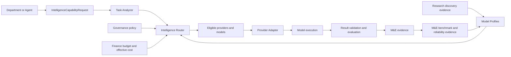

# Model-Independent Intelligence Architecture

Status: DRAFT

## Responsibility

CompanyOS Intelligence provides model-generated reasoning and content through provider-independent capability contracts. Departments and agents describe the outcome and constraints they require; they never select, instantiate, or call a concrete provider or model directly.

Intelligence owns:

- intelligence capability and request contracts;
- task analysis into normalized routing requirements;
- model/provider profile registration and evidence freshness;
- eligibility filtering and multi-factor routing;
- provider adapter contracts and normalized execution results;
- routing, usage, failure, and execution evidence for M&E evaluation;
- feedback flow from Research, Monitoring & Evaluation (M&E), Finance, and Governance.

It does not own organizational objectives, department semantics, policy meaning, budgets, ResourceConstraint semantics, Metrics, Evaluation or PerformanceProfile semantics, benchmarks, confidence/provenance/validity rules, provider credentials, workflow execution, or acceptance of model output as authoritative truth.

## Required flow

The arrows represent evidence and contract flow, not authority transfer. Research discovers; M&E evaluates; Finance constrains cost; Governance determines eligibility; the Router selects; adapters execute.

## Core contracts

### IntelligenceCapability

A versioned provider-independent outcome contract. It declares supported task families, input and output schemas, modalities, tool-use semantics, structured-output requirements, evidence requirements, failure taxonomy, and acceptance criteria. Examples such as summarization or classification are capability categories, not model names.

### IntelligenceRequest

The immutable request envelope submitted for one capability invocation. It includes request, organization, objective, workflow, department, and requesting-principal identities; IntelligenceCapability ID/version; normalized input references; permitted tools; TaskComplexity; QualityRequirement; PrivacyRequirement; a Finance-resolved ResourceConstraintSet; latency requirement; context-size needs; governance action/resource/context; idempotency identity; and required evidence.

`IntelligenceCapabilityRequest` is the application-facing form that becomes a validated IntelligenceRequest. It cannot contain a preferred provider or model. A temporary operator override is a separate governed routing constraint with explicit reason and expiry, never an untracked request field.

### TaskComplexity

A versioned analysis describing the work demanded by the request, not a model tier. It records an ordinal class (`LOW`, `MEDIUM`, `HIGH`, or `FRONTIER`), reasoning depth, decomposition need, context size, modality mix, tool-use complexity, uncertainty, and analyzer confidence with reasons.

### QualityRequirement

The minimum acceptable, measurable output quality. It identifies evaluation dimensions, thresholds, confidence, benchmark/task-family applicability, structured-output validity, and whether fallback or independent verification is required. Labels such as `STANDARD`, `HIGH`, and `CRITICAL` may summarize requirements but never replace numeric or testable criteria.

### PrivacyRequirement

The data-handling boundary for the request. It declares classification, allowed processing locations, retention and training restrictions, tenant isolation, encryption, logging/redaction rules, permitted provider trust classes, and whether local-only execution is required. Missing privacy classification fails closed.

### CostConstraint

The monetary specialization of the canonical Finance-owned [ResourceConstraint](../domain/resource.md). Intelligence references its identity/version as part of a ResourceConstraintSet and does not define its fields, composition, reservation, enforcement, or reconciliation semantics. Compute, time, storage, and concurrency limits use their respective canonical specializations rather than being folded into CostConstraint.

### ModelProfile

A versioned evidence-backed description of one model deployment exposed through one provider adapter. It contains stable profile, provider, adapter, and model/deployment identifiers; supported capabilities, modalities, tools, context/output limits, structured-output behavior, regions and privacy properties; current pricing evidence; latency distributions; availability and failure rates; M&E benchmark results; known limitations; evidence timestamps; and lifecycle status.

A profile is eligible only while required evidence is sufficiently fresh. Marketing claims may be recorded as unverified research evidence but cannot satisfy M&E thresholds.

### ProviderAdapter

A replaceable port that translates normalized IntelligenceRequests to one provider protocol and returns normalized outputs, tool calls, usage, provider identifiers, timing, finish reasons, safety signals, and typed failures. It owns protocol translation, authentication injection, cancellation, streaming normalization, and provider-specific error mapping. It does not own routing, Governance, budgets, retries across models, prompts as organizational policy, or acceptance decisions.

### RoutingDecision

An immutable explanation of one selection attempt. It records request and analyzer versions; candidate profiles; every exclusion and reason; Governance and Finance evidence versions; scoring dimensions and weights; selected profile; fallback sequence or absence; estimates; constraints; tie-breaking; router version; and timestamp. It is persisted before provider dispatch.

### ModelEvaluation

An M&E-owned specialization of the canonical [Evaluation](../domain/evaluation.md) contract with subject type `MODEL_PROFILE`. It adds model-profile/deployment identity, IntelligenceCapability and task-family references, modality and tool-use dimensions, model-specific finish/safety observations, and inference-environment applicability. It inherits Metric, benchmark, confidence, provenance, independence, validity, and lifecycle semantics without redefining them.

ModelEvaluations contribute to the subject's canonical `PerformanceProfile`; Intelligence consumes that profile and its source Evaluation identities as routing evidence. Individual preference, model self-evaluation, or provider claims remain labelled source evidence and cannot satisfy an independent design by themselves.

## Routing pipeline

1. Validate the capability, request schema, identities, evidence requirements, and absence of direct provider selection.
2. Task Analyzer produces versioned complexity and requirement features. Analyzer uncertainty can raise requirements but cannot silently relax them.
3. Governance evaluates each provider/model profile for policy and privacy eligibility. `DENY` removes it; `REQUIRE_APPROVAL` pauses routing and cannot enter the eligible set.
4. Finance verifies the budget account and supplies an exact ResourceConstraintSet, reservation evidence when required, and effective-cost evidence using price, expected usage, retries, failure rate, and verification cost.
5. Filter profiles by capability fit, modalities, context, tool support, quality threshold, privacy, data location, availability, applicable Finance constraint outcomes, evidence freshness, and operational health.
6. Rank only eligible profiles using the request's declared priorities across expected quality, historical reliability, latency, effective cost, and M&E confidence.
7. Persist RoutingDecision and execution intent before dispatch.
8. Execute through the selected ProviderAdapter. Fallback is a new routing attempt with preserved logical request identity and explicit failure evidence.
9. Validate protocol, schema, tool, safety, and evidence requirements. Model output remains untrusted until accepted through the owning workflow/domain operation.
10. Publish normalized execution and evaluation observations for M&E; Finance receives actual effective cost; Research may investigate gaps or newly available models.

## Eligibility before optimization

Hard constraints are never converted into weighted preferences. Governance, privacy, capability compatibility, required tool support, quality minimums, and hard Finance ResourceConstraints filter candidates before scoring. A cheaper or higher-scoring model cannot compensate for ineligibility.

Routing weights are versioned policy inputs. Tie-breaking is deterministic for equivalent evidence, while controlled experimentation requires explicit experiment identity, allocation policy, and Governance approval.

## Organizational responsibilities

| Owner | Responsibility | Cannot do |
|---|---|---|
| Research | Discover models/providers, limitations, pricing sources, and capability claims | Activate profiles or make routing decisions |
| M&E | Own Metric/Evaluation contracts; design benchmarks; publish ModelEvaluations and PerformanceProfiles | Weaken quality requirements or authorize providers |
| Finance | Own ResourceConstraints, reservations, reconciliation, budgets, and effective-cost evidence | Select models or waive Governance/privacy constraints |
| Governance | Determine provider/model eligibility and approval requirements | Optimize quality/cost among eligible profiles |
| Intelligence Router | Filter and rank using versioned evidence and constraints | Invent evidence, budgets, policies, or direct provider access |
| Department/Agent | Request an IntelligenceCapability outcome | Name or instantiate providers/models |

## Failure and fallback semantics

- Adapter errors normalize to authentication, authorization, policy, quota, rate-limit, timeout, unavailable, invalid-request, invalid-output, tool-protocol, safety, cancelled, or unknown.
- Unknown failures fail safely and reduce reliability evidence; they do not trigger unrestricted fallback.
- Fallback candidates pass the full current eligibility pipeline; a precomputed list is only advisory.
- Retry on the same model and fallback to another model are distinct decisions with separate attempt identities.
- Non-idempotent tool calls are never replayed merely because model execution failed.
- Budget and deadline reservations include expected retries, fallbacks, and required verification.
- Partial streaming output is non-authoritative and handled according to the capability contract.

## Invariants

- No department or agent selects, imports, instantiates, or calls a concrete model provider directly.
- Every model invocation originates from a validated IntelligenceRequest and persisted RoutingDecision.
- Only Governance-eligible profiles can be ranked or executed.
- `REQUIRE_APPROVAL` never counts as eligible until a fresh Governance evaluation returns `ALLOW`.
- Hard privacy, quality, tool, budget, and deadline constraints cannot be traded away by scoring.
- Intelligence consumes ResourceConstraint identities, versions, and Finance outcomes; it cannot create, redefine, relax, compose, reserve, or reconcile them.
- Provider adapters contain no organizational routing or policy decisions.
- Model output, provider metadata, and model self-evaluation are not authoritative organizational state.
- ModelEvaluation and PerformanceProfile evidence conforms to the canonical M&E contracts; Intelligence cannot redefine their confidence, provenance, benchmark, validity, or lifecycle semantics.
- Routing is reproducible from the recorded request, profiles, evidence, constraints, router version, and tie-break rule.
- Finance cost evidence includes expected failure, retry, fallback, and verification costs—not token price alone.
- M&E evidence informs future routing but cannot retroactively alter completed decisions.
- Research discovery cannot activate a model without validation, M&E evidence, Finance constraints, and Governance eligibility.
- Credentials remain outside requests, profiles, decisions, prompts, and audit evidence.
- Adding or removing a provider requires an adapter/profile change, not department, agent, or Kernel redesign.

## OSS evidence

- OpenAI Agents SDK separates its core [`Model` and `ModelProvider`](https://github.com/openai/openai-agents-js/blob/2d68a10f8c1593f37a8e291e7bce00634ba3e5dd/packages/agents-core/src/model.ts) interfaces from OpenAI-specific bindings. Borrow invocation and provider-resolution ports, streaming/usage normalization, and provider-independent agent orchestration. Reject allowing agent configuration strings to become CompanyOS routing authority.
- LangChain.js [`BaseLanguageModel`](https://github.com/langchain-ai/langchainjs/blob/5c9fdf2f0339deb92db84eaa838cf35c7dcdb027/libs/langchain-core/src/language_models/base.ts), [`BaseChatModel`](https://github.com/langchain-ai/langchainjs/blob/5c9fdf2f0339deb92db84eaa838cf35c7dcdb027/libs/langchain-core/src/language_models/chat_models.ts), and [`profile.ts`](https://github.com/langchain-ai/langchainjs/blob/5c9fdf2f0339deb92db84eaa838cf35c7dcdb027/libs/langchain-core/src/language_models/profile.ts) show common invocation, streaming, tool, structured-output, and capability-profile abstractions. Borrow normalized contracts; reject broad provider-specific kwargs leaking through CompanyOS capability boundaries.
- Vercel AI SDK's [`LanguageModelV4`](https://github.com/vercel/ai/blob/54686d6d61887e7a268ffc593324ec6e698a26ed/packages/provider/src/language-model/v4/language-model-v4.ts), [`ProviderV3`](https://github.com/vercel/ai/blob/54686d6d61887e7a268ffc593324ec6e698a26ed/packages/provider/src/provider/v3/provider-v3.ts), and provider documentation separate specifications, utilities, and concrete implementations while normalizing tools, streaming, usage, warnings, and finish reasons. Borrow versioned provider protocols and normalized results; reject treating API interchangeability as proof of equivalent quality, privacy, reliability, or cost.
- LiteLLM's [`complexity_router.py`](https://github.com/BerriAI/litellm/blob/c696fdfb05c2b11d9f7f4d06b23f4e783c85ef54/litellm/router_strategy/complexity_router/complexity_router.py), [`lowest_cost.py`](https://github.com/BerriAI/litellm/blob/c696fdfb05c2b11d9f7f4d06b23f4e783c85ef54/litellm/router_strategy/lowest_cost.py), [`lowest_latency.py`](https://github.com/BerriAI/litellm/blob/c696fdfb05c2b11d9f7f4d06b23f4e783c85ef54/litellm/router_strategy/lowest_latency.py), [`budget_limiter.py`](https://github.com/BerriAI/litellm/blob/c696fdfb05c2b11d9f7f4d06b23f4e783c85ef54/litellm/router_strategy/budget_limiter.py), and adaptive-router tests demonstrate pluggable routing strategies, health/cooldown, budgets, task classification, and feedback-informed selection. Borrow explicit strategies and operational evidence. Reject single-metric routing, request-controlled model aliases, in-memory learning as authoritative M&E, and optimization before Governance/privacy eligibility.
- JARVIS's [`provider.ts`](https://github.com/vierisid/jarvis/blob/6e144520c747a6e0b8673ba9b75769d5d5f10a9c/src/llm/provider.ts), [`manager.ts`](https://github.com/vierisid/jarvis/blob/6e144520c747a6e0b8673ba9b75769d5d5f10a9c/src/llm/manager.ts), and [`tiers.ts`](https://github.com/vierisid/jarvis/blob/6e144520c747a6e0b8673ba9b75769d5d5f10a9c/src/llm/tiers.ts) demonstrate common provider calls, fallback management, model tiers, and usage tracking. Borrow adapter and usage concepts. Reject configuration-selected providers, static tiers as sufficient routing evidence, and fallback without the complete CompanyOS eligibility pipeline.

No concrete provider, model, gateway, or routing library is selected.

## Open questions

- OPEN QUESTION: What is the first IntelligenceCapability and its measurable acceptance contract?
- OPEN QUESTION: Is Task Analyzer deterministic, model-assisted through a bootstrap route, or hybrid?
- OPEN QUESTION: What minimum M&E evidence is required before a newly discovered profile becomes eligible?
- OPEN QUESTION: Which evidence freshness windows apply to pricing, privacy, capabilities, latency, and quality?
- OPEN QUESTION: How are routing weights governed and validated against organizational objectives?
- OPEN QUESTION: Which requests require independent verification, ensembles, or human review?
- OPEN QUESTION: How are local/self-hosted deployments represented separately from model families?
- OPEN QUESTION: What reservation and reconciliation protocol connects Runtime routing attempts to Finance budgets?

## Dependencies

- [Top-level architecture](../../ARCHITECTURE.md)
- [System context](system-context.md)
- [Kernel](kernel.md)
- [Runtime](runtime.md)
- [Departments](departments.md)
- [Governance](governance.md)
- [Metric domain](../domain/metric.md)
- [Evaluation domain](../domain/evaluation.md)
- [Resource domain](../domain/resource.md)
- [Proposed ADR-0003](../adr/ADR-0003-model-independent-intelligence.md)
- Future capability, agent, event, knowledge, persistence, Research, and Finance specifications
