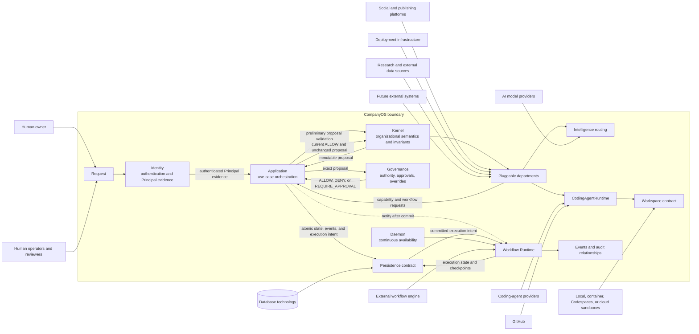

# CompanyOS System Context

Status: APPROVED

## Purpose

This document defines the CompanyOS system boundary: what CompanyOS owns, what it coordinates through contracts, and what remains external. It establishes vocabulary and trust boundaries but does not select providers, deployment topology, databases, or workflow infrastructure.

## What CompanyOS is

CompanyOS is an organizational runtime for semi-autonomous AI companies. It owns the durable organizational model and governs how humans, departments, workflows, agents, capabilities, providers, evidence, and resources participate in authorized work.

CompanyOS is not an AI model, coding agent, workflow engine, database, deployment platform, social network, or source-control host. Those may be external providers behind CompanyOS-owned contracts.

## What CompanyOS owns

CompanyOS owns:

- organization identity, mission, vision, policies, objectives, and governance semantics;
- department identities, contracts, authority boundaries, and lifecycle rules;
- provider-independent capability definitions;
- workflow definitions, legal domain transitions, and organizational workflow identity;
- authority evaluation, approval requirements, approval records, and human overrides;
- authoritative organizational records for actions, artifacts, results, metrics, evidence, and resource governance;
- provider registries, routing evidence, and the criteria used to select intelligence and coding-agent providers;
- internal events and audit relationships needed to explain organizational decisions and actions;
- ports for persistence, workflow execution, external actions, workspaces, intelligence, coding agents, publishing, deployment, and future integrations.

CompanyOS may delegate execution to external systems, but delegation does not transfer ownership of organizational meaning, authority, or authoritative state.

## Core terms

### Department

A department is an internal, pluggable organizational unit with a defined mission, responsibilities, authority, workflows, required capabilities, emitted and consumed events, metrics, and non-responsibilities. A department is not a provider, model, agent, process, or vendor integration. Adding a department must not require redesigning the Kernel.

### Capability

A capability is a provider-independent contract describing an outcome CompanyOS may request under defined inputs, outputs, policies, authority, evidence, and failure semantics. Implementations and vendors satisfy capabilities through adapters; departments depend on capability contracts rather than provider SDKs.

### Agent

An agent is a bounded computational participant assigned a role and delegated work within an objective, workflow, authority scope, budget, and tool set. An agent may propose commands, invoke permitted capabilities, and produce messages or artifacts. It cannot grant itself authority or directly mutate authoritative workflow state.

### Workflow runtime

The Workflow Runtime is the internal CompanyOS responsibility that schedules, dispatches, executes, suspends, retries, cancels, checkpoints, and resumes workflow work according to Kernel rules. A concrete workflow engine may be external behind a Runtime adapter. Runtime execution state and checkpoints support execution; they do not redefine organizational semantics.

### Workspace

A workspace is an isolated execution boundary in which an engineering or other high-risk capability may inspect inputs, use scoped credentials, run permitted commands, produce patches and artifacts, and collect evidence. CompanyOS owns the workspace contract and lifecycle policy; local containers, Codespaces, cloud sandboxes, and other implementations remain external providers.

### Intelligence provider

An intelligence provider is an external model, model-serving system, or inference service that implements an intelligence adapter. It generates outputs but does not own objectives, routing policy, organizational memory, approval state, or workflow truth.

### Coding-agent provider

A coding-agent provider is an external engineering executor such as Codex, Claude Code, Gemini CLI, OpenHands, Aider, or a future tool. It receives a bounded task and workspace through a CompanyOS adapter and returns changes, artifacts, execution evidence, and failures. Its conversation or session is not authoritative organizational state.

### External provider

An external provider is any independently operated system used through a CompanyOS-owned port or capability contract. Providers are replaceable, untrusted beyond their declared contract, subject to governance, and prevented from owning CompanyOS domain semantics.

### Authoritative organizational state

Authoritative organizational state is the persisted CompanyOS record that determines what the organization is, intends, permits, has approved, has done, and has learned. It includes organizational identity, policies, objectives, department and workflow definitions, legal workflow state, approvals, action records, artifacts and results, metrics and evaluation evidence, and resource-governance records.

Agent messages, model responses, provider sessions, external workflow-engine state, workspace files, caches, and transport events are not authoritative merely because they exist. They become organizationally meaningful only through validated CompanyOS operations and successful authoritative persistence.

## External actors and systems

| Actor or system | Relationship to CompanyOS | Boundary rule |
|---|---|---|
| Human owner | Establishes organization identity and ultimate governance authority | Human identity, approvals, overrides, and decisions must be attributable and durable. |
| Human operators and reviewers | Review, approve, reject, pause, redirect, and evaluate work | Interfaces cannot bypass governance or mutate state outside legal operations. |
| GitHub | External source-control, issue, branch, commit, review, and pull-request provider | GitHub evidence is external until correlated with CompanyOS tasks and artifacts. Protected operations require policy and scoped credentials. |
| AI model providers | Supply inference through intelligence adapters | Model output is untrusted input; providers do not own routing, memory, policy, or workflow state. |
| Coding-agent providers | Execute bounded engineering tasks | They operate in controlled workspaces and cannot approve or merge their own governed work. |
| Social and publishing platforms | Receive governed content and return delivery evidence | Departments request publishing capabilities rather than depending directly on platform APIs. |
| Deployment infrastructure | Builds, releases, hosts, and reports deployment outcomes | Deployment remains a governed external action distinct from Engineering. |
| Database technology | Implements CompanyOS persistence ports | CompanyOS owns schemas, transactions, invariants, and migration meaning; the database product is replaceable infrastructure. |
| Workflow-engine provider | May implement Runtime execution mechanics | It cannot determine legal CompanyOS transitions or become the organizational source of truth. |
| Workspace provider | Creates isolated execution environments | It receives only scoped inputs, credentials, network access, and lifetime. |
| External data and research sources | Supply observations, documents, feeds, and signals | All content is untrusted, provenance-bearing input until evaluated and accepted. |
| Future external systems | Integrate through versioned ports, events, and capabilities | New integrations must not require Kernel redesign or bypass governance. |

## System-context diagram

Arrows show interaction, not ownership transfer. Concrete adapters and communication direction remain to be specified by later architecture documents.

## Trust and authority boundaries

- All external content, model output, tool output, callbacks, and provider events are untrusted inputs until validated.
- Every external action must be attributable to an objective, workflow, actor, policy decision, and persisted intent.
- Credentials remain scoped to the smallest provider, capability, workspace, action, and lifetime required.
- Provider failure, delay, duplication, or compromise must not corrupt authoritative organizational state.
- Persistence must succeed before execution that depends on a state transition continues.
- Human intervention may pause, redirect, or override execution through governed operations, never by silently rewriting history.

## Reference patterns inspected

The following pinned implementations informed boundary placement without becoming CompanyOS architecture:

- [JARVIS agents](https://github.com/vierisid/jarvis/blob/6e144520c747a6e0b8673ba9b75769d5d5f10a9c/src/agents/agent.ts), [approval tooling](https://github.com/vierisid/jarvis/blob/6e144520c747a6e0b8673ba9b75769d5d5f10a9c/src/actions/tools/approval-tool.ts), and authority tests show explicit agent, tool, approval, and delegation boundaries. CompanyOS retains stronger separation between agent activity and organizational truth.
- [OpenHands agent-server adapter](https://github.com/OpenHands/OpenHands/blob/551e9a9ee6cc26feaa9ff2bf33a34f0442368c84/src/api/agent-server-adapter.ts), [runtime service](https://github.com/OpenHands/OpenHands/blob/551e9a9ee6cc26feaa9ff2bf33a34f0442368c84/src/api/runtime-service/agent-server-runtime-service.ts), and [workspace service](https://github.com/OpenHands/OpenHands/blob/551e9a9ee6cc26feaa9ff2bf33a34f0442368c84/src/api/workspaces-service/workspaces-service.api.ts) demonstrate separable agent-server, runtime, conversation, and workspace interfaces.
- [OpenAI Agents SDK agent](https://github.com/openai/openai-agents-js/blob/2d68a10f8c1593f37a8e291e7bce00634ba3e5dd/packages/agents-core/src/agent.ts), [model](https://github.com/openai/openai-agents-js/blob/2d68a10f8c1593f37a8e291e7bce00634ba3e5dd/packages/agents-core/src/model.ts), [handoff](https://github.com/openai/openai-agents-js/blob/2d68a10f8c1593f37a8e291e7bce00634ba3e5dd/packages/agents-core/src/handoff.ts), and [run state](https://github.com/openai/openai-agents-js/blob/2d68a10f8c1593f37a8e291e7bce00634ba3e5dd/packages/agents-core/src/runState.ts) support keeping agents, providers, tools, delegation, and execution state distinct.
- [LangGraph state graph](https://github.com/langchain-ai/langgraph/blob/1e44bda48ff4982b8ccfeec9c14156ea9e8ae5a2/libs/langgraph/langgraph/graph/state.py) and [checkpoint interface](https://github.com/langchain-ai/langgraph/blob/1e44bda48ff4982b8ccfeec9c14156ea9e8ae5a2/libs/checkpoint/langgraph/checkpoint/base/__init__.py) inform graph and checkpoint boundaries. CompanyOS rejects graph state as organizational authority.
- [Temporal workflow client](https://github.com/temporalio/sdk-typescript/blob/6df7e47797eab21ebd4644d0a2f5365a44032025/packages/client/src/workflow-client.ts) and [Worker](https://github.com/temporalio/sdk-typescript/tree/6df7e47797eab21ebd4644d0a2f5365a44032025/packages/worker/src) demonstrate client, workflow, activity, and worker separation. No Temporal dependency is selected.

## Explicit non-ownership

CompanyOS does not own or redefine:

- foundation-model weights, inference infrastructure, or provider availability;
- coding-agent internal reasoning, proprietary implementation, or vendor session storage;
- GitHub, social platform, deployment platform, or cloud-provider internals;
- database-engine internals;
- external workflow-engine internals;
- third-party content accuracy or availability;
- human judgment or legal accountability.

CompanyOS does own how these external systems are authorized, invoked, observed, correlated, evaluated, and represented in organizational records.

## Open questions

- OPEN QUESTION: Is the initial deployment single-organization or multi-tenant?
- OPEN QUESTION: Which user and service identity system authenticates human and machine actors?
- OPEN QUESTION: Which components initially run in one process, and which require separate deployment boundaries?
- OPEN QUESTION: Is the first Runtime internal, adapter-based, or backed by an external workflow engine?
- OPEN QUESTION: Which database and transaction model implement authoritative persistence?
- OPEN QUESTION: Which workspace provider is used for the first engineering slice?
- OPEN QUESTION: Which provider callbacks are accepted, and how are they authenticated and deduplicated?
- OPEN QUESTION: Which external actions are automatic, approval-required, or human-only?
- OPEN QUESTION: What data-residency and tenant-isolation requirements apply to providers?

## Dependent documents

This document is the scope prerequisite for `kernel.md`, `governance.md`, `events.md`, `persistence.md`, `runtime.md`, `daemon.md`, `departments.md`, `intelligence.md`, `workspaces.md`, `coding-agents.md`, and `knowledge.md`.
