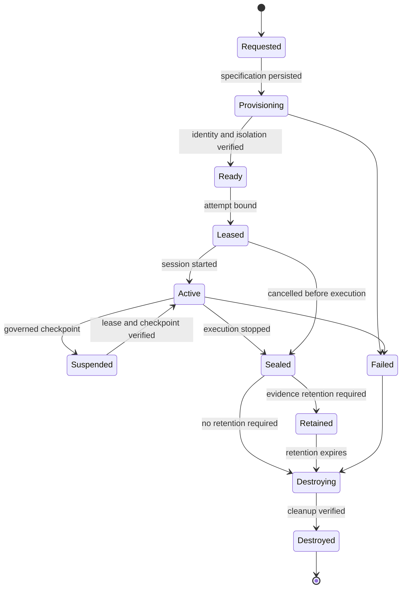

# Engineering Workspace Architecture

Status: DRAFT

## Responsibility

A `Workspace` is a leased, isolated execution boundary containing a controlled repository snapshot, tools, filesystem, process environment, network policy, credentials, resource limits, and auditable evidence for one purpose. An `EngineeringWorkspace` is the workspace specialization assigned to one `EngineeringTask` attempt.

CompanyOS owns the workspace contract, lifecycle policy, assignment, isolation requirements, and evidence. A `WorkspaceProvider` supplies the mechanism. A coding-agent provider uses an assigned workspace but neither provisions it nor controls its policy.

This boundary does not own engineering-task semantics, coding-agent selection, organizational authorization, workflow scheduling, repository hosting, or acceptance of changes. Those remain with [coding-agent orchestration](coding-agents.md), [Governance](governance.md), and the [Runtime](runtime.md).

## Core contracts

### Workspace

An immutable identity plus versioned specification and changing observed lifecycle state. The specification contains organization and task/attempt IDs; provider class; repository and exact base revision; branch policy; filesystem mounts; toolchain image or environment digest; CPU, memory, storage, process, time, and cost limits; network allowlist; secret grants; logging/redaction policy; and retention policy.

Observed state includes lifecycle phase, lease owner and expiry, provisioned resource identity, current repository revision and cleanliness, active processes, consumed resources, checkpoints, validation artifacts, and cleanup evidence.

### EngineeringWorkspace

A `Workspace` constrained to one engineering attempt. It provides a clean repository checkout at the recorded base revision, a task-specific feature branch, approved development tools, and only the credentials needed for separately authorized operations. Reuse across organizations or unrelated tasks is forbidden. Reuse across attempts requires verified restoration to a declared checkpoint; otherwise a fresh workspace is required.

### WorkspaceProvider

A replaceable infrastructure port that can provision, inspect, execute, stream logs, transfer bounded artifacts, snapshot, restore, suspend, resume, revoke credentials, and destroy workspaces. It reports typed observations and failures.

It does not decide task scope, provider routing, autonomy, network policy, credential authority, validation success, retention, or whether changes may be published.

### WorkspaceManager

The CompanyOS application service that validates specifications, obtains governance decisions, issues leases, calls a `WorkspaceProvider`, binds coding sessions, monitors limits, records observations, coordinates checkpoints, revokes access, and verifies cleanup. It reconciles provider state after interruption and prevents stale sessions from regaining authority.

The manager does not execute arbitrary agent-selected commands itself or make domain transitions without the owning use case.

## Lifecycle

Every transition is idempotent and persisted before a dependent action. `Failed` does not mean destroyed; cleanup remains an explicit, observable obligation.

## Isolation and authority boundaries

- **Filesystem:** expose only the task checkout, approved caches, and explicit artifact paths. Host and unrelated workspace paths are inaccessible.
- **Processes:** confine process trees, resource consumption, child processes, signals, and execution time. Termination includes descendants.
- **Network:** default deny; allow destinations and protocols required by the task. Package retrieval, model access, Git hosting, and deployment are separately classifiable.
- **Credentials:** issue short-lived, task-scoped grants just in time. Credentials are never embedded in prompts, repositories, images, checkpoints, or logs.
- **Tools:** commands and file operations pass normalized tool policy. Privileged host or container controls are unavailable to the coding agent.
- **Tenancy:** cache and image sharing must not expose source, secrets, logs, or artifacts across organizations.
- **Evidence:** capture attributed commands, exit status, bounded stdout/stderr, file changes, resource use, network decisions, checkpoints, and lifecycle events with redaction.

Containerization alone is not proof of isolation. Provider claims must be verified against required controls before the workspace becomes `Ready`.

## Repository and Git discipline

1. Resolve the repository and immutable base revision before provisioning.
2. Materialize a clean checkout and verify origin identity, object availability, submodule policy, and absence of unexpected changes.
3. Create a collision-resistant feature branch bound to the task and attempt; never work directly on a protected branch.
4. Track the initial status and later diff, untracked paths, mode changes, large files, generated outputs, and possible secrets.
5. Run required validation inside the workspace, then independently inspect its exit evidence and final repository state.
6. Seal the workspace before creating the final `EngineeringResult`.
7. Commit, push, and pull-request preparation require distinct authorization and least-privilege credentials. Merge credentials are never present in the implementation workspace.

Provider-generated commit messages and PR text are proposals. CompanyOS records actual Git object IDs and remote responses rather than trusting text returned by the agent.

## Recovery and reconciliation

- A lease has an owner, fencing token, heartbeat policy, and expiry. Operations with stale fencing tokens are rejected.
- A checkpoint records workspace-spec version, environment digest, repository HEAD/status, filesystem snapshot identity, active-session identity, and evidence cursor.
- Resume verifies checkpoint integrity, current authorization, secret expiry, task version, base ancestry, and provider compatibility.
- Provider loss yields an indeterminate state until CompanyOS inspects the provider and relevant external systems.
- Retry after corruption uses a fresh workspace and reapplies only verified changes or a verified checkpoint.
- Destruction revokes credentials first, stops processes, removes resources, and records provider-confirmed cleanup. Failure schedules reconciliation and alerts supervision.

## Evidence from mature implementations

| Reference and inspected source | Proven pattern | Adopt or adapt | Reject as sufficient boundary |
|---|---|---|---|
| [OpenHands workspace service](https://github.com/OpenHands/OpenHands/blob/551e9a9ee6cc26feaa9ff2bf33a34f0442368c84/src/api/workspaces-service/workspaces-service.api.ts), [runtime service](https://github.com/OpenHands/OpenHands/blob/551e9a9ee6cc26feaa9ff2bf33a34f0442368c84/src/api/runtime-service/agent-server-runtime-service.ts), and tests | Workspace inventory is separate from remote command execution; local and cloud modes share a service boundary; session keys scope remote calls | Separate lifecycle, runtime access, compatibility checks, and authenticated session binding | A saved path or remote sandbox status as proof of CompanyOS isolation or cleanup |
| [Aider Git repository adapter](https://github.com/Aider-AI/aider/blob/5dc9490bb35f9729ef2c95d00a19ccd30c26339c/aider/repo.py) and [coder lifecycle](https://github.com/Aider-AI/aider/blob/5dc9490bb35f9729ef2c95d00a19ccd30c26339c/aider/coders/base_coder.py) | Repository discovery, dirty-state handling, diff/commit integration, lint and test feedback | Verify repository state and retain concrete Git/validation evidence | The user's ordinary working tree, automatic dirty commits, or local Git configuration as an isolation model |
| [OpenAI Agents SDK shell and patch tools](https://github.com/openai/openai-agents-js/blob/2d68a10f8c1593f37a8e291e7bce00634ba3e5dd/packages/agents-core/src/tool.ts) | Shell and patch effects can expose approval decisions and normalized results | Put tool requests behind workspace policy and governance interrupts | Tool approval alone as filesystem, process, network, or tenant isolation |
| [JARVIS terminal executor](https://github.com/Node-Features/JARVIS/blob/6e144520c747a6e0b8673ba9b75769d5d5f10a9c/src/actions/terminal/executor.ts) and [Git manager](https://github.com/Node-Features/JARVIS/blob/6e144520c747a6e0b8673ba9b75769d5d5f10a9c/src/sites/git-manager.ts) | Commands have working-directory, environment, timeout, output, and branch/commit wrappers | Preserve typed results and small provider-neutral ports | Arbitrary shell strings, inherited environment, or path-based Git wrappers as a security boundary |

OpenHands is the strongest inspected workspace/runtime reference. Aider and JARVIS primarily demonstrate repository and tool mechanics, not production tenant isolation. No inspected implementation is adopted as the CompanyOS workspace architecture.

## Invariants

- One engineering workspace is bound to one organization, task, attempt, immutable base revision, and active lease.
- Coding agents never choose the workspace provider, isolation policy, credentials, base revision, or protected-branch rules.
- A workspace is not `Ready` until identity, repository state, environment digest, and required isolation controls are verified.
- No host path, unrelated repository, organization secret, or merge credential is available by default.
- Network and credentials are default-deny and independently granted, expiring, attributable, and revocable.
- Workspace observations and agent session history are evidence, not authoritative workflow state.
- Publication cannot occur with implementation credentials unless that exact action is governed.
- Resume and retry cannot weaken the original task, policy, budget, or isolation constraints.
- Cleanup is explicit, idempotent, verified, and auditable.
- Persistence succeeds before provisioning, leasing, session start, resume, publication, or lifecycle advancement.

## OPEN QUESTIONS

- Which initial provider mechanism will satisfy the required isolation controls: local process sandbox, container, VM, or remote workspace service?
- Which tasks require fully ephemeral workspaces versus retained forensic snapshots?
- What network destinations and package-cache sharing are permitted by default?
- What fencing and checkpoint guarantees can every initial `WorkspaceProvider` support?
- Which evidence must be retained when source or command output contains regulated or secret material?
