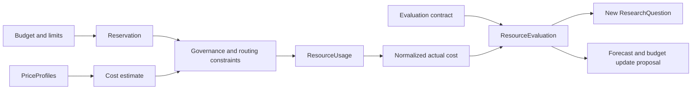

# Finance Department

Status: DRAFT

## Mission

Finance answers: **Was the outcome worth the resources consumed?** It supplies resource intelligence, budgets, normalized price and usage evidence, resource limits, and evaluations of effective cost relative to measured outcomes.

Finance owns the lifecycle and quality of canonical financial and [resource constraints](../domain/resource.md). It does not determine whether an output is correct, conduct primary external research, select concrete providers, authorize actions by itself, execute department work, or change objective success criteria.

## Responsibilities

Finance owns:

- organization, objective, department, workflow, and capability budgets;
- budget reservations, commitments, actuals, releases, periods, currencies, and attribution;
- model/provider pricing versions and normalized usage cost;
- coding-agent pricing and effective execution cost;
- workspace, compute, storage, network, database, observability, and deployment infrastructure cost;
- labor or other resource categories when explicitly modeled and governed;
- effective cost per successful result and marginal cost/value analysis;
- resource limits, forecasts, variance, budget alerts, and financial evidence for Governance and routing.

Research may discover price changes or alternatives. Finance validates and normalizes price terms, billing units, credits, taxes, currency, effective dates, and allocation rules before they become financial evidence.

## Core contracts

### Budget

A versioned resource envelope for an organization scope, owner, period, currency/resource units, permitted categories, limits, reservation policy, contingency, rollover behavior, alert thresholds, and applicable Governance references. A budget is a constraint, not permission to act.

### ResourceConstraint

The canonical Finance-owned limit contract defined by the [Resource domain](../domain/resource.md). Its specializations are `CostConstraint`, `ComputeConstraint`, `TimeConstraint`, `StorageConstraint`, and `ConcurrencyConstraint`. Finance issues, versions, composes, reserves against, and reconciles these constraints; consumers do not redefine them.

### PriceProfile

A dated, provenance-bearing normalization of provider/model, coding-agent, workspace, infrastructure, or service pricing. It includes source, billing dimensions, tiers, minimums, credits, currency conversion basis, taxes/fees policy, effective interval, region, confidence, and assumptions.

### ResourceUsage

An attributable observation of consumed resources linked to organization, objective, workflow, execution, attempt, capability, profile/provider, workspace, result, budget account, measurement method, and time. Estimates and invoice-confirmed actuals remain distinguishable.

### ResourceEvaluation

A versioned assessment combining Finance-owned cost/usage evidence with M&E-owned outcome and quality evidence. It records total and effective cost, successful-result denominator, failed-attempt and retry cost, allocation method, budget variance, alternatives, marginal value, uncertainty, assumptions, and recommendation or new ResearchQuestion.

`effective cost per successful result` includes the cost of failed, retried, rejected, and evaluation attempts allocated under the declared method. It must not count only successful calls.

## Resource flow

Application coordinates persistence of accepted reservations and estimates before execution where a hard limit applies. Runtime records execution usage through its persistence contract, and Finance proposes reconciliation through an Application use case. Budget changes and exceptional overruns require governed transitions; Finance cannot silently expand a limit to accommodate completed spending.

Budgets, constraints, reservations, usage, Metrics, Evaluations, and ResourceEvaluations cross the department boundary only through shared Application, event, workflow, evidence, and persistence contracts. Finance never calls M&E, Research, Intelligence, or Coding Agent implementations to obtain or publish them.

## Failure semantics

Finance follows the shared [adaptive-loop failure semantics](../architecture/departments.md#adaptive-loop-failure-semantics):

- missing, stale, incompatible, or unverifiable pricing never defaults to zero, free, unlimited, or the last known price without an explicit validity rule;
- a PriceProfile refresh may be `RETRYABLE` within source and time bounds; otherwise the cost or ResourceEvaluation is `INCONCLUSIVE` or the candidate is ineligible;
- missing or indeterminate usage holds the applicable reservation and enters reconciliation; it cannot be silently released or recorded as zero;
- insufficient allocation, outcome, Metric, Evaluation, currency, tax, or shared-cost evidence produces an explicit `INCONCLUSIVE` ResourceEvaluation;
- ResourceEvaluation deduplication fingerprints the result/evaluation versions, usage records, PriceProfiles, allocation method, budget period, and comparison set;
- duplicate billing, usage, event, or evaluation delivery cannot double-count cost, reserve resources twice, change a budget twice, or create duplicate feedback;
- Governance `DENY` is terminal for the exact spend, exception, or budget-change proposal; `REQUIRE_APPROVAL` is an escalation and not available budget;
- expired PriceProfiles, ResourceEvaluations, savings recommendations, or budget proposals cannot support new execution or Objective creation without revalidation;
- invalid currency/unit conversion, forbidden spend, exhausted reconciliation, closed accounting period, or an irreparable attribution conflict is `TERMINAL` for that record version;
- material unexplained variance, repeated missing pricing, indeterminate external charges, exhausted loop bounds, or a high-impact budget exception escalates to attributable human review.

A ResourceEvaluation or budget recommendation may propose an Objective through a distinct Application use case. It cannot create an Objective, authorize spending, or alter a Budget automatically.

## Boundary with Research and M&E

Research answers whether a cheaper/free alternative or market change exists and provides source evidence. Finance owns validated effective pricing, total resource implications, and budget fit. M&E owns measured quality, correctness, reliability, and outcomes.

Finance consumes M&E outcome evidence without rewriting it. It may calculate cost-versus-quality and Pareto comparisons, but an option below the minimum M&E quality or Governance eligibility threshold is not made acceptable merely because it is cheaper.

Finance supplies exact ResourceConstraint versions, reservations, usage evidence, and constraint outcomes to Intelligence and CodingAgent routers. Routers select among eligible profiles; Finance never chooses a provider directly, and routers never relax or reinterpret Finance contracts.

## Invariants

- Every cost links to resource usage, a price/allocation version, organization scope, time, and result or shared-cost allocation.
- Estimates, reservations, commitments, billed actuals, credits, and forecasts are distinct records.
- A budget constrains resource use but does not authorize an otherwise prohibited action.
- Finance cannot redefine M&E quality, correctness, or success to improve a resource evaluation.
- M&E cannot alter price, allocation, or budget evidence to improve an outcome evaluation.
- Routers consume Finance constraints and evidence but retain provider selection responsibility.
- Cost, compute, time, storage, and concurrency constraints retain their canonical Resource-domain meanings in every consumer.
- Failed, retried, rejected, and evaluation work is included in effective-cost analysis.
- Missing or stale pricing and usage evidence produces explicit uncertainty or ineligibility according to policy.
- Resource-limit and budget transitions are governed and versioned; Application coordinates their persistence and audit records.
- Missing pricing, indeterminate usage, duplicate feedback, and inconclusive ResourceEvaluations fail closed and retain explicit dispositions.
- No ResourceEvaluation, price signal, variance, or budget recommendation directly creates an Objective.

## Metrics and accountability

Finance is accountable for budget variance, forecast accuracy, cost attribution coverage, price freshness, unallocated spend, reservation accuracy, effective cost per successful result, resource efficiency, and savings that preserve required quality and reliability. M&E independently evaluates whether Finance recommendations actually improve organizational outcomes.

## OPEN QUESTIONS

- Which currency, exchange-rate source, allocation method, and accounting period are canonical initially?
- Which resource limits are hard execution gates versus alert-only controls?
- How are shared infrastructure and human-review costs allocated across objectives and departments?
- What budget authority and approval thresholds apply by organization and autonomy level?
- How are free tiers, prepaid credits, committed-use discounts, and opportunity cost represented?

## Dependencies

- [Department architecture](../architecture/departments.md)
- [Application layer](../architecture/application.md)
- [Workflow domain](../domain/workflow.md)
- [Artifact domain](../domain/artifact.md)
- [Evidence domain](../domain/evidence.md)
- [Event domain](../domain/event.md)
- [Resource domain](../domain/resource.md)
- [Metric domain](../domain/metric.md)
- [Evaluation domain](../domain/evaluation.md)
- Future shared price, usage, budget, research-question, and resource-evaluation contracts
