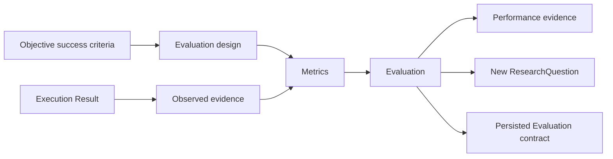

# Monitoring & Evaluation Department

Status: DRAFT

## Mission

Monitoring & Evaluation (M&E) answers: **Did our actions work?** It independently defines measurements, observes results, evaluates outcome and system performance, and feeds credible learning back into Research, Governance, routing, objectives, and executing departments.

M&E evaluates effectiveness and performance. It does not discover external change as its primary responsibility, own budgets or pricing, execute corrective work, authorize actions, select concrete providers, or redefine an objective after observing its result.

## Responsibilities

M&E owns measurement and evaluation of:

- quality, correctness, completeness, safety, and policy compliance;
- objective outcomes, adoption, user impact, and unintended effects;
- workflow, runtime, provider, and infrastructure reliability;
- department and agent performance;
- model performance by capability, task class, and constraints;
- coding-agent performance by task class, repository, and workspace environment;
- cost-versus-quality evidence in partnership with Finance, while Finance owns monetary valuation and budget decisions.

M&E owns the lifecycle and quality of the canonical [Metric](../domain/metric.md) and [Evaluation](../domain/evaluation.md) contracts, including evaluation designs, baselines, comparison groups, evaluator independence, sampling, benchmark/test versions, data-quality assessment, confidence interpretation, validity, and provenance.

## Core contracts

### Result

A normalized output or outcome record from department, workflow, capability, provider, model, coding agent, or external action execution. It links to objective, expected outcome, attempt, artifacts, evidence, governance decision, resource usage, and failure data. A provider's self-reported success is only one evidence source.

### MetricDefinition

The canonical versioned measurement specification defined by the [Metric domain](../domain/metric.md). M&E creates, reviews, activates, and supersedes definitions; evaluated departments and providers cannot redefine them.

### Metric

An immutable measurement conforming to one exact MetricDefinition version, as defined by the [Metric domain](../domain/metric.md).

### Evaluation

The canonical attributable assessment defined by the [Evaluation domain](../domain/evaluation.md). M&E owns its design, execution, review, validity, and lifecycle.

### PerformanceProfile

The canonical M&E-owned projection over compatible Evaluations defined by the [Evaluation domain](../domain/evaluation.md). Provider and routing architectures consume it without redefining it.

## Evaluation flow

Evaluation criteria and collection plans should be fixed before execution when feasible. Post-hoc changes are versioned and disclosed. M&E preserves failures and negative results; missing evidence yields uncertainty, not invented success.

Results, Evidence, Metrics, Evaluations, and follow-up questions cross the department boundary only through shared Application, event, workflow, artifact, evidence, and persistence contracts. M&E never calls an evaluated department or Finance implementation to obtain or publish them.

## Failure semantics

M&E follows the shared [adaptive-loop failure semantics](../architecture/departments.md#adaptive-loop-failure-semantics):

- stale Results, Evidence, MetricDefinitions, benchmarks, evaluator calibration, or environment evidence is excluded or refreshed before evaluation;
- insufficient samples, independence, coverage, data quality, or compatible Metrics produce `INCONCLUSIVE`, with the precise evidence gap preserved;
- `INCONCLUSIVE` is a valid Evaluation outcome, not a failed check to be automatically retried until it passes;
- transient benchmark infrastructure or evidence-access failure may be `RETRYABLE` without changing the frozen EvaluationDesign; a changed design creates a new version;
- Evaluation deduplication fingerprints subject/version, question, design, benchmark, evidence set, environment, and observation window;
- duplicate Result or event delivery cannot create another Metric, Evaluation, PerformanceProfile update, follow-up question, or Objective;
- Governance `DENY` is terminal for a governed evaluation action; `REQUIRE_APPROVAL` is an escalation and never authorizes data access or publication;
- incompatible evidence, invalidated benchmark, prohibited evaluation, expired design, or exhausted attempts is `TERMINAL` for that evaluation version;
- conflicting high-impact evidence, evaluator-independence failure, repeated inconclusive outcomes, or exhausted feedback-loop bounds requires attributable human review.

An Evaluation may recommend a follow-up ResearchQuestion or Objective proposal. It cannot create an Objective, change success criteria, or advance an objective workflow automatically.

## Independence and anti-gaming

- The evaluated department cannot unilaterally define acceptance, select only favorable evidence, or edit the final evaluation.
- Implementation agents cannot independently approve their own output.
- Benchmark fixtures, evaluator models, thresholds, and scoring code are versioned and protected according to risk.
- Model-based judging declares model/profile, prompts, calibration, known bias, and corroborating checks.
- High-stakes evaluation requires evidence independent of the system being evaluated.
- Metrics are reviewed for proxy gaming, survivorship bias, leakage, confounding, and distribution shift.

## Boundary with Research and Finance

Research owns external findings and proposed opportunities or risks. M&E may identify unexplained outcome changes and create a new ResearchQuestion but does not claim an external cause without research evidence.

M&E owns quality and outcome measurements, including cost-versus-quality curves. Finance owns price normalization, actual resource cost, budget impact, effective cost per successful result, and whether resource use was worth the outcome under organizational constraints. M&E cannot lower a quality threshold to make spending appear efficient; Finance cannot redefine quality to make cost appear favorable.

## Invariants

- Every metric identifies its definition version, subject, window, unit, and source evidence.
- Every evaluation identifies criteria, method, evaluator, evidence, uncertainty, and limitations.
- Provider, agent, or department self-report is never sufficient evidence of success.
- Evaluation cannot mutate the evaluated Result, Objective, or historical metric.
- M&E evidence informs routing but does not select a concrete model or coding agent.
- Negative, inconclusive, and failed outcomes remain visible and affect performance evidence.
- Comparisons use compatible task, environment, policy, and time contexts or disclose incompatibility.
- Application coordinates persistence of accepted Evaluation and performance evidence before dependent routing or objective decisions advance.
- Inconclusive, duplicate, stale, denied, terminal, retryable, and escalated evaluations remain distinguishable in PerformanceProfile projections.
- No Evaluation, Metric, or PerformanceProfile directly creates an Objective.

## Metrics and accountability

M&E itself is accountable for evaluation coverage, evidence completeness, detection delay, reproducibility, calibration, false-positive/negative rates, independence, benchmark freshness, and whether recommendations improve future decisions. Oversight of M&E independence is an `OPEN QUESTION`.

## OPEN QUESTIONS

- Which outcomes require human, automated, or dual evaluation?
- What minimum evidence establishes causal impact rather than correlation?
- How is evaluator independence enforced for small organizations with overlapping roles?
- What benchmark suites and production feedback thresholds initially qualify models and coding agents?
- Who audits M&E definitions and evaluator quality?

## Dependencies

- [Department architecture](../architecture/departments.md)
- [Application layer](../architecture/application.md)
- [Workflow domain](../domain/workflow.md)
- [Result domain](../domain/result.md)
- [Artifact domain](../domain/artifact.md)
- [Evidence domain](../domain/evidence.md)
- [Event domain](../domain/event.md)
- [Metric domain](../domain/metric.md)
- [Evaluation domain](../domain/evaluation.md)
- [Resource domain](../domain/resource.md)
- Future shared research-question and resource-evaluation contracts
