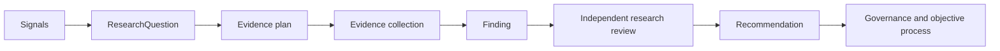

# Research Department

Status: DRAFT

## Mission

Research answers: **What changed?** It turns bounded signals and questions into traceable evidence, findings, and recommendations so CompanyOS can adapt to customer, market, technical, security, provider, and ecosystem change.

Research discovers and interprets change. It does not decide whether CompanyOS actions worked, determine whether outcomes justified their cost, authorize action, create objectives, execute another department's work, or declare generated material to be approved organizational knowledge.

## Responsibilities

Research owns systematic discovery concerning:

- customer problems, unmet needs, behavior, and feedback;
- competitor moves, substitutes, positioning, and market opportunities;
- technology shifts, standards, platform changes, and security risks;
- new or changed AI models and intelligence providers;
- new or changed coding agents and workspace providers;
- cheaper, free, local, or open-source alternatives;
- relevant open-source ecosystems, licenses, maturity, and maintenance signals.

Research also owns research methods, source-selection rationale, evidence collection plans, finding synthesis, uncertainty disclosure, and recommendation traceability. It may request Intelligence capabilities, but concrete providers are selected by CompanyOS routing.

## Core contracts

### Signal

A provenance-bearing indication that something may have changed: an event, observation, customer report, publication, benchmark release, price change, vulnerability, repository change, provider announcement, or department request. A signal is neither verified evidence nor a finding.

### ResearchQuestion

An immutable, versioned inquiry containing question identity, requester, scope, decision context, hypotheses or unknowns, required evidence, source constraints, quality and freshness criteria, time/cost limits, conflicts of interest, security classification, and completion criteria.

Questions may originate from prior evaluations or resource evaluations, but Research controls only their investigation—not the authority of the requester or any resulting action.

### Evidence

An attributable observation or source captured with origin, author/publisher, retrieval time, applicable event time, immutable reference or digest, method, license/usage constraints, classification, limitations, and confidence interpretation. Research evidence preserves contrary evidence and source independence; model-generated summaries are transformations, not primary sources.

### Finding

A versioned answer or bounded claim derived from cited evidence. It records supporting and contradicting evidence, method, scope, assumptions, uncertainty, freshness, reviewer status, and provenance. A finding cannot exceed what its evidence supports.

### Recommendation

A proposed course of action linked to findings, expected outcome, assumptions, risks, alternatives, resource estimate, validation criteria, expiry/review condition, and required Governance action. It is neither authorization nor an Objective.

## Research flow

Research persists each accepted contract before dependent work advances. Material scope or method changes create a new question or plan version. Findings and recommendations retain source lineage when transformed into artifacts or proposed knowledge.

## Failure semantics

Research follows the shared [adaptive-loop failure semantics](../architecture/departments.md#adaptive-loop-failure-semantics):

- unavailable sources, rate limits, or temporary collection failures are `RETRYABLE` only within the ResearchQuestion's time, cost, source, and attempt bounds;
- stale evidence must be refreshed or excluded; if remaining evidence is insufficient, the Finding is `INCONCLUSIVE` rather than inferred;
- insufficient source quality, independence, provenance, or coverage produces an explicit evidence gap and may trigger human review;
- ResearchQuestion deduplication uses the normalized question, organization, scope, decision context, active validity window, and source Evaluation/ResourceEvaluation versions;
- duplicate signals or deliveries attach evidence to the existing question when compatible and never create duplicate Findings or Recommendations;
- a Recommendation has an expiry/review condition and cannot progress after expiry without a new validated version;
- Governance `DENY` closes the exact recommendation/action version; `REQUIRE_APPROVAL` persists an escalation and waits for human resolution;
- source prohibition, invalid scope, exhausted bounds, or an irreparable provenance failure is `TERMINAL`; collection failures that can succeed unchanged may be `RETRYABLE`;
- repeated transient failure, material source contradiction, high-impact security findings, or exhausted loop depth escalates to attributable human review.

A Finding or Recommendation may propose an Objective through a distinct Application use case. It cannot create, authorize, schedule, or mutate an Objective directly.

## Interfaces

- **Inputs:** governed questions, public and licensed sources, customer evidence, security signals, provider/repository changes, department results, M&E evaluations, and Finance resource evaluations.
- **Outputs:** evidence sets, findings, research artifacts, recommendations, technology/provider profiles, risk signals, and new ResearchQuestions.
- **Events:** may subscribe to persisted signals and evaluation/resource-evaluation events; emits only persisted research lifecycle facts.
- **Knowledge:** proposes items with provenance. Approval follows the [Knowledge architecture](../architecture/knowledge.md).

All inputs and outputs cross the department boundary as persisted shared contracts. A source department may be recorded as provenance, but Research resolves the contract through Application, event, workflow, artifact, evidence, or knowledge ports rather than invoking that department.

## Boundary with M&E and Finance

Research may discover benchmark methods, provider claims, and prices. M&E owns measured performance and outcome evaluation. Finance owns normalized prices, budgets, cost allocation, and value/resource evaluation. Research does not rank providers for production use, certify quality, approve spending, or decide cost-effectiveness.

When Research identifies a cheaper model or coding agent, it produces a finding and recommendation. M&E benchmarks capability and reliability; Finance evaluates effective cost and budget fit; Governance determines eligibility; the applicable router selects.

## Invariants

- Every finding and recommendation links to attributable evidence and states uncertainty and freshness.
- Source quantity, popularity, model confidence, or agent consensus does not equal truth.
- Research keeps primary sources distinguishable from interpretation and generated synthesis.
- Research recommendations cannot authorize action, allocate budget, create objectives, or mutate another department's state.
- Research cannot directly select production model, coding-agent, infrastructure, or workspace providers.
- Contrary evidence, source conflicts, licensing constraints, and security concerns remain visible.
- Customer and external data collection passes Governance, privacy, and authority checks.
- Results become approved knowledge only through the knowledge-review lifecycle.
- Questions, Findings, and Recommendations retain explicit retryable, terminal, inconclusive, or escalated disposition and stable deduplication identity.
- Expired, denied, duplicate, stale, or insufficiently supported Recommendations cannot create Objectives.

## Metrics and accountability

Research is accountable for question cycle time, source diversity and quality, provenance completeness, finding freshness, uncertainty calibration, contradiction discovery, recommendation traceability, and later predictive usefulness. M&E owns the definitions and independent evaluation of these measures; Research cannot grade itself authoritatively.

## OPEN QUESTIONS

- Which research classes require human review before a finding or recommendation is published?
- What source-quality and independence criteria apply by question type?
- Which customer research methods and data sources are initially permitted?
- How are time-sensitive provider, pricing, vulnerability, and license findings expired or revalidated?

## Dependencies

- [Department architecture](../architecture/departments.md)
- [Application layer](../architecture/application.md)
- [Knowledge](../architecture/knowledge.md)
- [Events](../architecture/events.md)
- [Persistence](../architecture/persistence.md)
- [Governance](../architecture/governance.md)
- [Metric domain](../domain/metric.md)
- [Evaluation domain](../domain/evaluation.md)
- [Resource domain](../domain/resource.md)
- Future shared workflow, artifact, evidence, finding, recommendation, and resource-evaluation contracts
