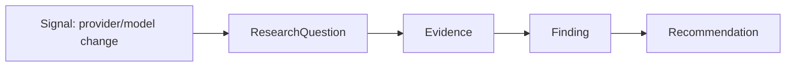

# Research Loop — First Vertical Slice

Status: APPROVED

## Purpose

This is the canonical use-case document for `ROADMAP.md` Phase 4 Slice 1: the first narrow, end-to-end pass through [`docs/departments/research.md`](../departments/research.md)'s `Signal → ResearchQuestion → Evidence → Finding → Recommendation` flow. It documents the concrete vertical slice — one signal type, five Application use cases, five HTTP endpoints — and references `research.md`'s contracts rather than redefining them, per this directory's own stated purpose ([`README.md`](README.md)).

Like every first vertical slice in this codebase (Phase 1's Workflow slice, Phase 3's Governance/Identity slices), this document is deliberately narrower than the aspirational domain contract it implements. Later Phase 4+ slices widen it; they do not need to widen this document's already-correct scope statements, only add new ones.

## Signal type this slice handles

A manually-submitted **provider/model change signal** — a human reports that an AI model or intelligence provider has changed (new model released, price changed, a capability added or removed, an open-source/local alternative appeared). `research.md` names this explicitly in scope ("new or changed AI models and intelligence providers," "cheaper, free, local, or open-source alternatives"), and it gives the eventual Recommendation something concrete to reference — the single `ModelProfile`/`ProviderAdapter` pair [`ADR-0004`](../adr/ADR-0004-first-slice-technology-stack.md) already fixed — rather than an invented, disconnected example.

No external source integration exists this slice (`ROADMAP.md`'s own wording: "not an external source integration yet"). A human submits the signal directly; nothing polls or scrapes for one.

## Flow

Each arrow is a distinct Application use case and a distinct HTTP endpoint — kept separate even though one signal will typically flow through all five in one sitting, the same way Phase 1 kept `CREATE_WORKFLOW` and `START_WORKFLOW` as distinct commands. This proves each contract boundary `research.md` defines, not just the end-to-end happy path.

| Step | Application use case | Endpoint |
|---|---|---|
| Submit a Signal | `SubmitSignal` | `POST /v1/research/signals` |
| Open a ResearchQuestion from it | `OpenResearchQuestion` | `POST /v1/research/signals/{signalId}/questions` |
| Record Evidence against the question | `RecordEvidence` | `POST /v1/research/questions/{questionId}/evidence` |
| Publish a Finding citing evidence | `PublishFinding` | `POST /v1/research/questions/{questionId}/findings` |
| Issue a Recommendation from a Finding | `IssueRecommendation` | `POST /v1/research/findings/{findingId}/recommendations` |

`GET /v1/research/questions/{questionId}` returns a question's current status and linked evidence/findings/recommendations, mirroring `GET /v1/workflows/{workflowId}`'s read-projection role.

## Governance

Each of the five write use cases is a distinct governed Action (`research.signal.submit`, `research.question.open`, `research.evidence.record`, `research.finding.publish`, `research.recommendation.issue`), evaluated through the same `governance.Evaluate` pipeline Workflow commands use, with a persisted `GovernanceDecision` for every call — no action reaches persistence without one, same invariant as every prior slice.

All five are `AUTOMATIC` autonomy this slice. `research.md`'s own `OPEN QUESTIONS` leaves "which research classes require human review before a finding or recommendation is published?" unresolved — this document does not invent an answer. A future slice may raise `PublishFinding`/`IssueRecommendation` to `APPROVAL_REQUIRED` once that question is actually decided, reusing Phase 3's existing `REQUIRE_APPROVAL` machinery exactly as `CancelWorkflow` did.

**Departure from existing Workflow commands, worth noting explicitly:** these five actions use the real authenticated, resolved Principal (`docs/architecture/identity.md`'s flow, wired in `ROADMAP.md` Phase 3 Slices 4 and 6) as both the submitting Principal and Governance's evaluated identity — not `internal/fixtures.Registry`'s Service/Human stand-ins. Existing Workflow commands keep using those fixtures unchanged (Slice 6 explicitly deferred rewiring them); Research has no prior fixture-based behavior to preserve, so it is where real Principal-driven Governance decisions start.

## Scope boundaries

- **No Objective-proposal gate.** `docs/architecture/departments.md`'s adaptive loop continues Recommendation → Objective proposal → Governance → Kernel → Objective; `ROADMAP.md` assigns that distinct Application use case to **Phase 4 Slice 4**. A Recommendation is this slice's terminal artifact. It is never turned into an Objective here, directly or automatically.
- **No independent-review step.** The flow diagram in `research.md` shows "Independent research review" between Finding and Recommendation. This slice does not build reviewer-role or separation-of-duties machinery for it — the submitting Principal publishes the Finding and issues the Recommendation directly. `research.md`'s own open question about which research classes require human review is carried forward, not answered.
- **No `DepartmentRegistry`/`DepartmentDefinition` machinery.** `docs/architecture/departments.md`'s registration/validation/activation lifecycle is aspirational infrastructure nothing in this codebase has built yet. This slice adds real logic directly to the existing empty `internal/departments/research` package stub — it does not build the registry that stub would eventually be validated and activated through.
- **No idempotency-key replay.** Workflow's compare-and-swap replay guard exists because a duplicate financial/execution command is unsafe. A duplicate research Signal is not safety-critical the same way, and `research.md`'s "duplicate signals attach evidence to the existing question" behavior is explicitly aspirational beyond this narrow slice — resubmitting the same signal creates a second row.
- **API only.** No `web` UI this slice, matching the existing "curl runbook" precedent `internal/adapters/httpapi/workflows.go` already established for backend-verifiable-first delivery.
- **Minimal field sets.** `Signal`/`ResearchQuestion`/`Evidence`/`Finding`/`Recommendation` each carry only the fields this flow actually needs, not `research.md`'s full aspirational contract (hypotheses, quality/freshness criteria, source constraints, time/cost limits, conflicts of interest, security classification, validation criteria, etc.). Widening these is future work, not a defect in this slice.

## Invariants carried from `research.md` (unchanged, restated for this narrow slice)

- A Finding must cite at least one Evidence record and cannot exceed what that evidence supports.
- A Recommendation links to the Finding that produced it and is never itself authorization or an Objective.
- Research cannot select a production model/provider directly — a Recommendation proposes; the applicable router (not built yet) would decide, and Slice 4's Objective-proposal gate is the only path from a Recommendation toward organizational action.

## OPEN QUESTIONS (carried forward from `research.md`, not resolved here)

- Which research classes require human review before a Finding or Recommendation is published?
- What source-quality and independence criteria apply by question type?
- How are time-sensitive provider/pricing findings expired or revalidated?

## Dependencies

- [Research department](../departments/research.md)
- [Department architecture](../architecture/departments.md)
- [Evidence domain](../domain/evidence.md)
- [Governance architecture](../architecture/governance.md)
- [Identity architecture](../architecture/identity.md)
- `ADR-0004` (the single `ModelProfile`/`ProviderAdapter` this slice's example signal references)
